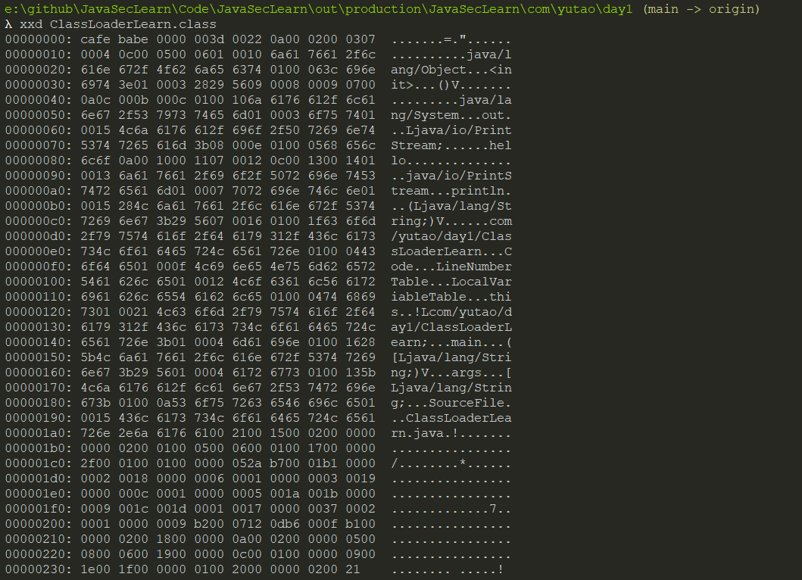

[toc]


# 前言+流程

java语言依赖JVM，运行的时候，需要先编译成class文件，之后java类初始化的时候会调用`java.lang.ClassLoader`加载类字节码，ClassLoader会调用JVM的native方法来定义一个`java.lang.Class`实例。


类文件编译流程：


示例：

```java
package com.yutao.day1;

public class ClassLoaderLearn {
    public static void main(String[] args) {
        System.out.println("hello");
    }
}
```

可以通过jdk自带的javap命令反汇编查看class文件对应的`com.yutao.day1.ClassLoaderLearn`类，


JVM在执行`ClassLoaderLearn`之前会先解析class的二进制内容，JVM执行的其实就是如上`javap`命令生成的字节码。




# 双亲委派模型

>   类加载阶段分为加载、连接、初始化三个阶段，而加载阶段需要通过类的全限定名来获取定义了此类的二进制字节流。**Java特意把这一步抽出来用类加载器来实现**。把这一步骤抽离出来使得应用程序可以按需自定义类加载器。并且得益于类加载器，OSGI、热部署等领域才得以在JAVA中得到应用。
>
>   在Java中**任意一个类都是由这个类本身和加载这个类的类加载器来确定这个类在JVM中的唯一性**。也就是你用你A类加载器加载的`com.aa.ClassA`和你A类加载器加载的`com.aa.ClassA`它们是不同的，也就是用`instanceof`这种对比都是不同的。所以即使都来自于同一个class文件但是由不同类加载器加载的那就是两个独立的类。


双亲委派的意思是如果一个类加载器需要加载类，那么首先它会把这个类请求委派给父类加载器去完成，每一层都是这样。一直到顶层后，父类的加载器也不能完成该请求时，子类才会尝试加载，。这里父类并不是继承关系，而是委派、逻辑的关系。

优点：

-   能够实现有些类避免重复加载使用，直接先给父加载器加载，不用子加载器再次重复加载。
-   保证java核心库的类型安全。比如网络上传输了一个java.lang.Object类，通过双亲模式传递到启动类当中，然后发现其Object类早已被加载过，所以就不会加载这个网络传输过来的java.lang.Object类，保证我们的java核心API库不被篡改，出现类似用户自定义java.lang.Object类的情况。

# 类加载器

类加载器大致分为两种，一种是JVM自带的类加载器，分别为**引导类加载器**、**扩展类加载器**和**APP类加载器/系统类加载器**。另外一种就是用户**自定义的类加载器**，可以通过继承java.lang.ClassLoader类的方式实现自己的类加载器。

所有java类必须经过jvm加载后才能运行，`ClassLoader`主要作用就是java类文件的加载，在JVM类加载器中最顶层的是`Bootstrap ClassLoader（引导类加载器）`、`Extension ClassLoader（扩展类加载器）`、`App ClassLoader（系统类加载器）`。`AppClassLoader`是默认的类加载器，如果类加载时我们不指定类加载器的情况下，默认会使用`AppClassLoader`加载类，`ClassLoader.getSystemClassLoader()`返回的系统类加载器也是`AppClassLoader`。

## 引导类加载器

>   引导类加载器(BootstrapClassLoader)，底层原生代码是C++语言编写，属于jvm一部分，不继承java.lang.ClassLoader类，也没有父加载器，主要负责加载核心java库(即JVM本身)，存储在/jre/lib/rt.jar目录当中。(同时处于安全考虑，BootstrapClassLoader只加载包名为java、javax、sun等开头的类)。

rt.jar里的类都是由`BootstrapClassLoader`来加载：


`BootstrapClassLoader`无父加载器 ：

object类是所有子类的父类，这里使用object：


## 扩展类加载器

>   扩展类加载器(ExtensionsClassLoader)，由sun.misc.Launcher$ExtClassLoader类实现，用来在/jre/lib/ext或者java.ext.dirs中指明的目录加载java的扩展库。Java虚拟机会提供一个扩展库目录，此加载器在目录里面查找并加载java类。

这里的jar包都由扩展类加载器进行加载：


比如选择dnsns.jar：


## APP类加载器/系统类加载器

>   App类加载器/系统类加载器（AppClassLoader），由sun.misc.Launcher$AppClassLoader实现，一般通过通过(java.class.path或者Classpath环境变量)来加载Java类，也就是我们常说的classpath路径。通常我们是使用这个加载类来加载Java应用类，可以使用ClassLoader.getSystemClassLoader()来获取它


# Java类动态加载方式

java类加载分为显式和隐式

显式：通过java反射或者ClassLoader来动态加载一个类

隐式：`类名.方法名()`或者new 示例，

```java
// 反射加载
Class.forName("com.xxx.xx.xx..x.x.x.xx");//默认会初始化被加载类的静态属性和方法

// ClassLoader加载
this.getClass().getClassLoader().loadClass("com.xxx.xx.xx..x.x.x.xx");//默认不会初始化
```


# ClassLoader类核心方法

除了`BootstrapClassLoader`，其他类加载器都继承`ClassLoader`，下面是核心方法：

`ClassLoader`类有如下核心方法：

1.  `loadClass`（加载指定的Java类）
2.  `findClass`（查找指定的Java类）
3.  `findLoadedClass`（查找JVM已经加载过的类）
4.  `defineClass`（定义一个Java类,将字节码解析成虚拟机识别的Class对象）
5.  `resolveClass`（链接指定的Java类）

## loadClass

加载指定的java类:

loadClass:

1.  首先使用`getClassLoadingLock()`检查这个类是否被加载过。
2.  调用`findLoadedClass`检查是否已经初始化，如果JVM已经初始化过该类，返回类对象
3.  如果创建当前`ClassLoader`时传入了父类加载器，就是用父类加载器加载，否则使用`Bootstrap ClassLoader`加载
4.  如果上一步还未加载，调用`findClass`加载类。
5.  如果当前`ClassLoader`没有重写`findClass`方法，返回异常
6.  ........

```java
protected Class<?> loadClass(String name, Boolean resolve) throws ClassNotFoundException
    {
	synchronized (getClassLoadingLock(name)) {
		// First, check if the class has already been loaded
		Class<?> c = findLoadedClass(name);
		if (c == null) {
			long t0 = System.nanoTime();
			try {
				if (parent != null) {
					c = parent.loadClass(name, false);
				} else {
					c = findBootstrapClassOrNull(name);
				}
			}
			catch (ClassNotFoundException e) {
				// ClassNotFoundException thrown if class not found
				// from the non-null parent class loader
			}
			if (c == null) {
				// If still not found, then invoke findClass in order
				// to find the class.
				long t1 = System.nanoTime();
				c = findClass(name);
				// this is the defining class loader; record the stats
				sun.misc.PerfCounter.getParentDelegationTime().addTime(t1 - t0);
				sun.misc.PerfCounter.getFindClassTime().addElapsedTimeFrom(t1);
				sun.misc.PerfCounter.getFindClasses().increment();
			}
		}
		if (resolve) {
			resolveClass(c);
		}
		return c;
	}
}
```


## findClass

查找指定的Java类

```java
    /**
     * Finds the class with the specified <a href="#name">binary name</a>.
     * This method should be overridden by class loader implementations that
     * follow the delegation model for loading classes, and will be invoked by
     * the {@link #loadClass <tt>loadClass</tt>} method after checking the
     * parent class loader for the requested class.  The default implementation
     * throws a <tt>ClassNotFoundException</tt>.
     *
     * @param  name
     *         The <a href="#name">binary name</a> of the class
     *
     * @return  The resulting <tt>Class</tt> object
     *
     * @throws  ClassNotFoundException
     *          If the class could not be found
     *
     * @since  1.2
     */
    protected Class<?> findClass(String name) throws ClassNotFoundException {
        throw new ClassNotFoundException(name);
    }
```

## findLoadedClass

查找JVM已经加载过的类

```java
    /**
     * Returns the class with the given <a href="#name">binary name</a> if this
     * loader has been recorded by the Java virtual machine as an initiating
     * loader of a class with that <a href="#name">binary name</a>.  Otherwise
     * <tt>null</tt> is returned.
     *
     * @param  name
     *         The <a href="#name">binary name</a> of the class
     *
     * @return  The <tt>Class</tt> object, or <tt>null</tt> if the class has
     *          not been loaded
     *
     * @since  1.1
     */
    protected final Class<?> findLoadedClass(String name) {
        if (!checkName(name))
            return null;
        return findLoadedClass0(name);
    }
```

## defineClass

定义一个Java类，将字节码解析成虚拟机识别的Class对象。往往和findClass()方法配合使用

```java
    /**
     * Converts an array of bytes into an instance of class <tt>Class</tt>.
     * Before the <tt>Class</tt> can be used it must be resolved.  This method
     * is deprecated in favor of the version that takes a <a
     * href="#name">binary name</a> as its first argument, and is more secure.
     *
     * @param  b
     *         The bytes that make up the class data.  The bytes in positions
     *         <tt>off</tt> through <tt>off+len-1</tt> should have the format
     *         of a valid class file as defined by
     *         <cite>The Java&trade; Virtual Machine Specification</cite>.
     *
     * @param  off
     *         The start offset in <tt>b</tt> of the class data
     *
     * @param  len
     *         The length of the class data
     *
     * @return  The <tt>Class</tt> object that was created from the specified
     *          class data
     *
     * @throws  ClassFormatError
     *          If the data did not contain a valid class
     *
     * @throws  IndexOutOfBoundsException
     *          If either <tt>off</tt> or <tt>len</tt> is negative, or if
     *          <tt>off+len</tt> is greater than <tt>b.length</tt>.
     *
     * @throws  SecurityException
     *          If an attempt is made to add this class to a package that
     *          contains classes that were signed by a different set of
     *          certificates than this class, or if an attempt is made
     *          to define a class in a package with a fully-qualified name
     *          that starts with "{@code java.}".
     *
     * @see  #loadClass(String, boolean)
     * @see  #resolveClass(Class)
     *
     * @deprecated  Replaced by {@link #defineClass(String, byte[], int, int)
     * defineClass(String, byte[], int, int)}
     */
    @Deprecated
    protected final Class<?> defineClass(byte[] b, int off, int len)
        throws ClassFormatError
    {
        return defineClass(null, b, off, len, null);
    }
```

## resolveClass

链接指定java类

```java
    /**
     * Links the specified class.  This (misleadingly named) method may be
     * used by a class loader to link a class.  If the class <tt>c</tt> has
     * already been linked, then this method simply returns. Otherwise, the
     * class is linked as described in the "Execution" chapter of
     * <cite>The Java&trade; Language Specification</cite>.
     *
     * @param  c
     *         The class to link
     *
     * @throws  NullPointerException
     *          If <tt>c</tt> is <tt>null</tt>.
     *
     * @see  #defineClass(String, byte[], int, int)
     */
    protected final void resolveClass(Class<?> c) {
        resolveClass0(c);
    }
```


# 用户自定义ClassLoader

实际使用中，不仅仅希望使用classpath中的类或者jar包，还可能希望使用本地磁盘或者网上的，这时候就用到了自定义类加载的方式。

上面的loadclass中，调用的是findClass(String)方法，所以加载自定义类的话重写的是findClass而不是loadClass

步骤：

1.  继承ClassLoader
2.  重写findClass()
3.  在findClass中调用defineClass方法


# URLClassLoader

继承自ClassLoader，可以加载本地磁盘和网络中的jar包类文件。

本地class文件调用：

先写个java，内容是弹计算器，和sout

```java
package com.yutao.day1;

public class execcalc {
    public execcalc() {
        System.out.println("Test success!!!");
        try {
            Runtime.getRuntime().exec("cmd /c calc.exe");
        } catch (Exception e) {
            e.printStackTrace();
        }
    }
}
//E:\github\JavaSecLearn\Code\JavaSecLearn\src\com\yutao\day1
```


```java
package com.yutao.day1;

import java.io.File;
import java.net.MalformedURLException;
import java.net.URI;
import java.net.URL;
import java.net.URLClassLoader;

public class ClassLoaderLearn {
    public static void main(String[] args) throws ClassNotFoundException, NullPointerException, InstantiationException, IllegalAccessException, MalformedURLException {
        File file = new File("E:\\github\\JavaSecLearn\\Code\\JavaSecLearn\\src\\com\\yutao\\day1\\");
        URI uri = file.toURI();
        URL url = uri.toURL();

        URLClassLoader classLoader = new URLClassLoader(new URL[]{url});
        Class clazz = classLoader.loadClass("com.yutao.day1.execcalc");
        clazz.newInstance();
    }
}
```

弹calc成功解析class文件。