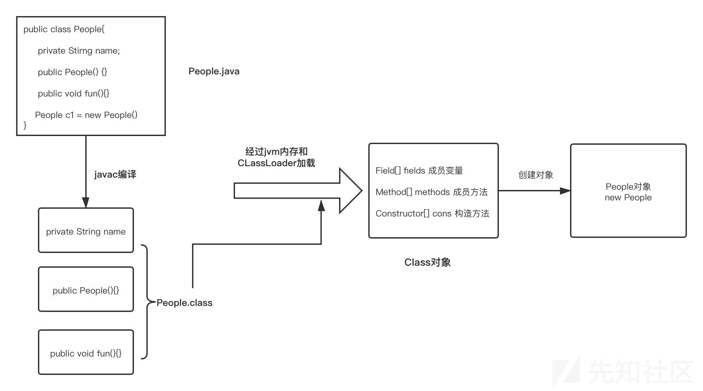

[toc]

>   https://xz.aliyun.com/t/9117
>
>   https://javasec.org/javase/Reflection/Reflection.html
>
>   https://forum.butian.net/share/1333

# 反射机制

通过反射可以获取任何类的成员方法，成员变量，构造方法等信息，还可以动态创建java类实例、调用任意的类方法、修改任意类成员变量值等。

流程图：

