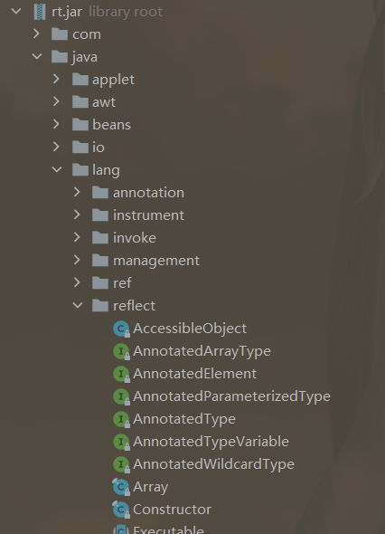
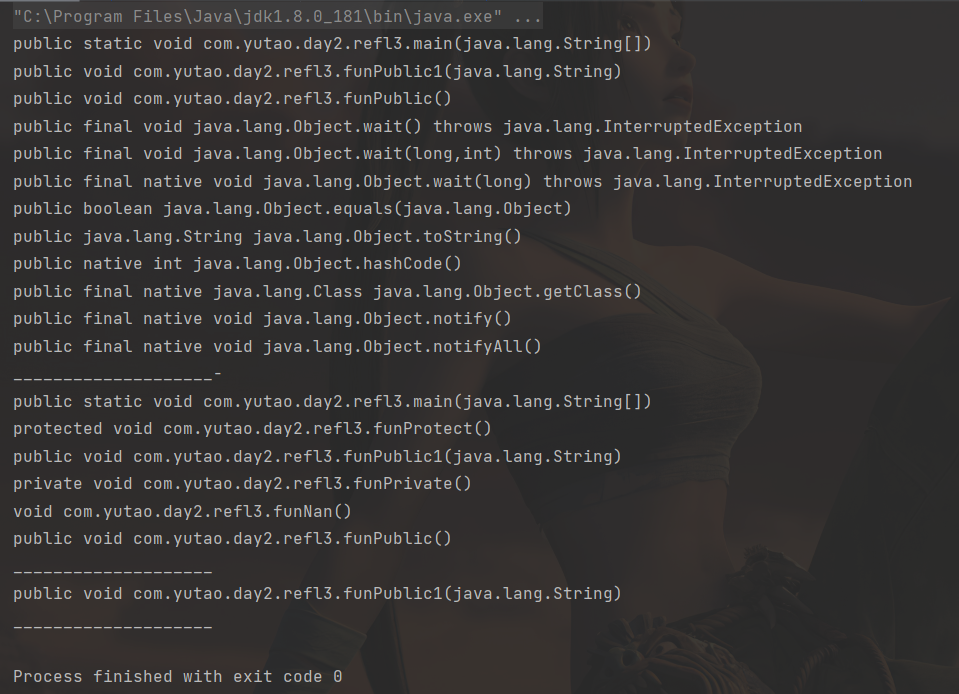
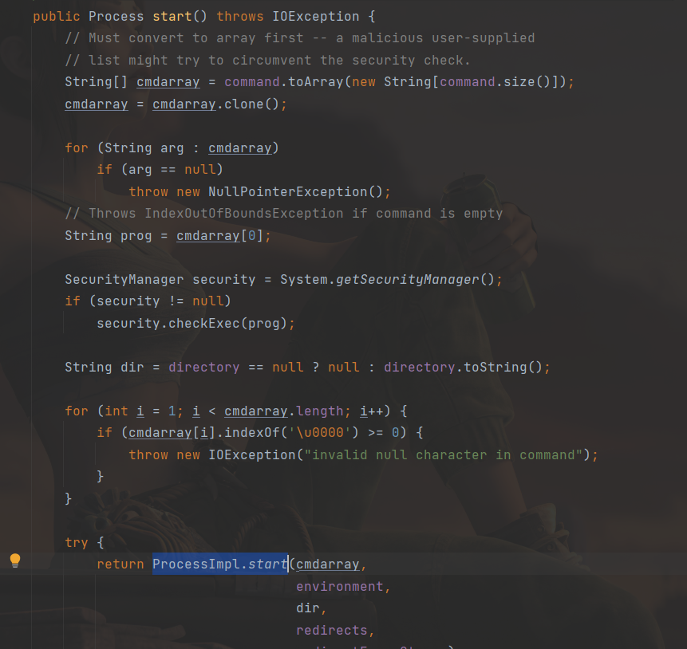

[toc]

>   https://xz.aliyun.com/t/9117
>
>   https://javasec.org/javase/Reflection/Reflection.html
>
>   https://forum.butian.net/share/1333
>
>   https://xz.aliyun.com/t/2342

# 反射机制

通过反射可以获取任何类的成员方法，成员变量，构造方法等信息，还可以动态创建java类实例、调用任意的类方法、修改任意类成员变量值等。

流程图：


反射机制相关的类在`java.lang.reflect`包中：



需要重点关注的类：

-   `java.lang.Class`：类对象;
-   `java.lang.reflect.Constructor`：类的构造器对象;
-   `java.lang.reflect.Field`：类的属性对象;
-   `java.lang.reflect.Method`：类的方法对象;

# 获取类对象

反射操作的是`java.lang.Class`对象，所以要先获取Class对象。

一般来说，想要创建某个实例，直接new即可，但是Class类不能直接new，跟进去看下构造方法，可以发现构造器私有，只能jvm创建：

```java
/*
* Private constructor. Only the Java Virtual Machine creates Class objects.
* This constructor is not used and prevents the default constructor being
* generated.
*/
private Class(ClassLoader loader) {
	// Initialize final field for classLoader.  The initialization value of non-null
	// prevents future JIT optimizations from assuming this final field is null.
	classLoader = loader;
}
```

接下来说下怎么获取到Class对象：

一般来说有4个方法：(假设obj为某个类的实例)

1.  `Class.forName(name)`：如果知道某个类的名字，可以使用forName()，这个不需要import导入其他类。
2.  `obj.getClass()`：obj为某个类的实例。
3.  `TestClass.class`：如果已将加载了某个类，可以直接使用`类名.class`
4.  使用`ClassLoader.getSystemClassLoader().loadClass(name)`直接获取。

示例：

```java
package com.yutao.day2;

public class refl {
    public static void main(String[] args) throws ClassNotFoundException {

        Class cl1 = refl.class;
        System.out.println(cl1.getClass());
        System.out.println(cl1.getName());

        refl fl = new refl();
        Class cl2 = fl.getClass();
        System.out.println(cl2.getClass());
        System.out.println(cl2.getName());

        Class cl3 = Class.forName("com.yutao.day2.refl");
        System.out.println(cl3.getClass());
        System.out.println(cl3.getName());
        
        Class cl4 = ClassLoader.getSystemClassLoader().loadClass("com.yutao.day2.refl");
        System.out.println(cl4.getClass());
        System.out.println(cl4.getName());
    }
}

//output:
class java.lang.Class
com.yutao.day2.refl
class java.lang.Class
com.yutao.day2.refl
class java.lang.Class
com.yutao.day2.refl
class java.lang.Class
com.yutao.day2.refl
```

获取数组类型的Class对象的话：

```java
Class<?> doubleArray = Class.forName("[D");//相当于double[].class
Class<?> cStringArray = Class.forName("[[Ljava.lang.String;");// 相当于String[][].class
```

反射调用类的时候，要用`$`代替：`com.yutao.day2.refl$testFun`（调用内部类）


# 获取成员变量

使用`Field`，位于`java.lang.reflect.Field`，用到的方法：

-   `Field[] getFields()` ：获取所有public修饰的成员变量
-   `Field[] getDeclaredFields()`： 获取所有的成员变量，不考虑修饰符
-   `Field getField(String name)`： 获取指定名称的 public修饰的成员变量
-   `Field getDeclaredField(String name)`： 获取指定的成员变量

示例：

```java
package com.yutao.day2;


import java.lang.reflect.Field;

public class refl2 {
    public String namePublic = "name123";
    protected String nameProtect = "name456";
    private String namePrivate = "name789";
    String nameNan = "name000";

    public static void main(String[] args) {
        try {
            Class testClass = Class.forName("com.yutao.day2.refl2");

            Field[] fArr1 = testClass.getDeclaredFields();
            Field[] fArr2 = testClass.getFields();
            System.out.println("getDeclaredFields():");
            System.out.println(fArr1);
            for (Field f : fArr1) {
                System.out.printf("%s ", f);
                System.out.println(f.getName());
            }
            System.out.println("getFields():");
            System.out.println(fArr2);
            for (Field f : fArr2) {
                System.out.printf("%s ", f);
                System.out.println(f.getName());
            }
            System.out.println("_________________________");
            Field f1 = testClass.getField("namePublic");
            System.out.printf("%s %s\n", f1, f1.getName());

            Field f2 = testClass.getDeclaredField("namePrivate");
            System.out.printf("%s %s\n", f2, f2.getName());
        } catch (Exception e) {
            e.printStackTrace();
        }
    }

}
//output
getDeclaredFields():
[Ljava.lang.reflect.Field;@74a14482
public java.lang.String com.yutao.day2.refl2.namePublic namePublic
protected java.lang.String com.yutao.day2.refl2.nameProtect nameProtect
private java.lang.String com.yutao.day2.refl2.namePrivate namePrivate
java.lang.String com.yutao.day2.refl2.nameNan nameNan
getFields():
[Ljava.lang.reflect.Field;@5cad8086
public java.lang.String com.yutao.day2.refl2.namePublic namePublic
_________________________
public java.lang.String com.yutao.day2.refl2.namePublic namePublic
private java.lang.String com.yutao.day2.refl2.namePrivate namePrivate
```


# 获取成员方法

使用`Method`，位于`java.lang.reflect.Method`，使用到的方法：

-   `Method getMethod(String name, 类<?>... parameterTypes)` ：返回该类所声明的public方法
-   `Method getDeclaredMethod(String name, 类<?>... parameterTypes)`：返回该类所声明的所有方法
-   //第一个参数获取该方法的名字，第二个参数获取标识该方法的参数类型
-   `Method[] getMethods()` ：获取所有的public方法，包括类自身声明的public方法，父类中的public方法、实现的接口方法
-   `Method[] getDeclaredMethods()` ： 获取该类中的所有方法

示例：

```java
package com.yutao.day2;

import java.lang.reflect.Method;
import java.util.zip.CheckedOutputStream;

public class refl3 {
    public void funPublic() {
        System.out.println("Public Fun");
    }

    public void funPublic1(String str) {
        System.out.println("Public Fun" + str);
    }

    protected void funProtect() {
        System.out.println("Protect Fun");
    }

    private void funPrivate() {
        System.out.println("Private Fun");
    }

    void funNan() {
        System.out.println("Nan Fun");
    }

    public static void main(String[] args) {
        try {
            Class testClass = Class.forName("com.yutao.day2.refl3");

            Method[] mtharr = testClass.getMethods();
            for (Method m : mtharr) {
                System.out.println(m);
            }
            System.out.println("____________________-");
            Method[] mtharr1 = testClass.getDeclaredMethods();
            for (Method m : mtharr1) {
                System.out.println(m);
            }
            System.out.println("____________________");
            Method m1 = testClass.getMethod("funPublic1", String.class);
            System.out.println(m1);
            System.out.println("____________________");
        } catch (Exception e) {
            e.printStackTrace();
        }
    }
}
```

输出：



# 获取构造函数

使用Constructor，位于：`java.lang.reflect.Constructor`，用到的方法：

-   `Constructor<?>[] getConstructors()` ：只返回public构造函数
-   `Constructor<?>[] getDeclaredConstructors()` ：返回所有构造函数
-   `Constructor<> getConstructor(类<?>... parameterTypes)`: 匹配和参数配型相符的public构造函数
-   `Constructor<> getDeclaredConstructor(类<?>... parameterTypes)` ： 匹配和参数配型相符的构造函数

这里不写代码了，跟上面都差不多。


# 反射创建类对象

流程：

1.  反射获取类对象
2.  使用`newInstance`创建实例对象
3.  使用`getMethod`获取类方法
4.  使用`invoke`调用方法

用到的一些方法，先看下示例：

```java
package com.yutao.day2;

import java.lang.reflect.Constructor;
import java.lang.reflect.Method;

public class refl4 {
    public void testFun() {
        System.out.println("test seccess!");
    }

    public static void main(String[] args) {
        try {
            Class cls = Class.forName("com.yutao.day2.refl4");
            Object ob = cls.newInstance();//创建实例对象
            Method md = cls.getMethod("testFun");//获取方法
            md.invoke(ob);//调用类实例对象的方法

        } catch (Exception e) {
            e.printStackTrace();
        }
    }
}
```


# Runtime

如果这样写：

```java
Class cls = Class.forName("java.lang.Runtime");
cls.getMethod("exec", String.class).invoke(cls.newInstance(), "id");
```

会报这样的错：`can not access a member of class java.lang.Runtime with modifiers "private"`

原因是runtime的构造方法为私有：

```java
/**
 * Every Java application has a single instance of class
 * <code>Runtime</code> that allows the application to interface with
 * the environment in which the application is running. The current
 * runtime can be obtained from the <code>getRuntime</code> method.
 * <p>
 * An application cannot create its own instance of this class.
 *
 * @author  unascribed
 * @see     java.lang.Runtime#getRuntime()
 * @since   JDK1.0
 */

public class Runtime {
    private static Runtime currentRuntime = new Runtime();

    /**
     * Returns the runtime object associated with the current Java application.
     * Most of the methods of class <code>Runtime</code> are instance
     * methods and must be invoked with respect to the current runtime object.
     *
     * @return  the <code>Runtime</code> object associated with the current
     *          Java application.
     */
    public static Runtime getRuntime() {
        return currentRuntime;
    }

    /** Don't let anyone else instantiate this class */
    private Runtime() {}
```

跟getRuntime，到exec

```java
    public Process exec(String[] cmdarray, String[] envp, File dir)
        throws IOException {
        return new ProcessBuilder(cmdarray)
            .environment(envp)
            .directory(dir)
            .start();
    }
```

会调`start()`，而`start`为在`ProcessBuilder`中，之后调用`ProcessImpl.start()`



`ProcessImpl`继承自`Process`，继续，star会返回：`new ProcessImpl()`

调用关系：

```
java.lang.Runtime -->

getRuntime().exec -->

java.lang.ProcessBuilder -->

start() -->
		
java.lang.ProcessImp.start()
```


Runtime使用的是单例设计模式：

>[23中设计模式全归纳](https://github.com/youlookwhat/DesignPattern#3-%E5%8D%95%E4%BE%8B%E8%AE%BE%E8%AE%A1%E6%A8%A1%E5%BC%8F)
>
>   **使用单例模式能够保证整个应用中有且只有一个实例**。

所以只能使用`getRuntime()`来获取`Runtime`对象：

```java
Class cls = Class.forName("java.lang.Runtime");
cls.getMethod("exec", String.class).invoke(cls.getMethod("getRuntime").invoke(cls), "calc");
```


来看p牛的例子:

```java
public void execute(String className, String methodName) throws Exception {
 Class clazz = Class.forName(className);
 clazz.getMethod(methodName).invoke(clazz.newInstance());
}
```

使用runtime来测试下：

```java
package com.yutao.day2;

public class refl5 {
    public static void main(String[] args) {
        try {
            Class clazz = Class.forName("java.lang.Runtime");
            clazz.getMethod("exec", String.class).invoke(clazz.getMethod("getRuntime").invoke(clazz), "calc.exe");

        } catch (Exception e) {
            e.printStackTrace();
        }
    }
}
```

成功弹计算器，而且竟然没有报毒！！
