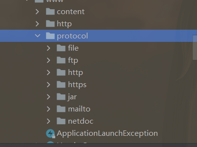
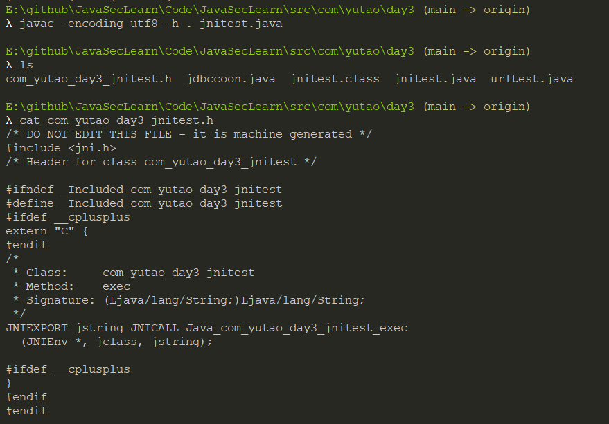
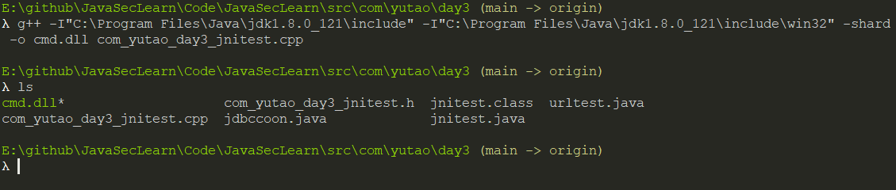

[toc]


# JDBC

JDBC(Java Database Connectivity)，java提供的对于数据库操作的API


## 连接

java通过`java.sql.DriverManager`来管理所有数据库驱动注册，要建立数据库连接需要先注册`java.sql.DriverManager`驱动类，之后调用getConnection方法连接。

>   JDBC定义了一个叫`java.sql.Driver`的接口类负责实现对数据库的连接，所有的数据库驱动包都必须实现这个接口才能够完成数据库的连接操作。`java.sql.DriverManager.getConnection(xx)`其实就是间接的调用了`java.sql.Driver`类的`connect`方法实现数据库连接的。数据库连接成功后会返回一个叫做`java.sql.Connection`的数据库连接对象，一切对数据库的查询操作都将依赖于这个`Connection`对象。

步骤：

1.  注册驱动：Class.forName("数据库驱动类名")
2.  获取连接，DriverManager.getConnection(xxx)

真实的java项目不会使用原生JDBC的driverManager去连接db

而是使用数据源：`java.sql.DateSource`代替`java.sql.DriverManager`

## DataSource

### Spring MVC

>   在Spring MVC中我们可以自由的选择第三方数据源，通常我们会定义一个`DataSource Bean`用于配置和初始化数据源对象，然后在Spring中就可以通过Bean注入的方式获取数据源对象了。

配置数据源：

```xml
<bean id="dataSource" class="com.alibaba.druid.pool.DruidDataSource" init-method="init" destroy-method="close">
        <property name="url" value="${jdbc.url}"/>
        <property name="username" value="${jdbc.username}"/>
        <property name="password" value="${jdbc.password}"/>
        ....
        />
```

上面定义了一个id为dataSource的spring bean对象，`${jdbc.xxxx}$`采用的是spring的`property-placeholder`制定了一个`properties`文件

```xml
<context:property-placeholder location="classpath:/config/jdbc.properties"/>
```

jdbc.properties:

```java
jdbc.driver=com.mysql.jdbc.Driver
jdbc.url=jdbc:mysql://localhost:3306/mysql?autoReconnect=true&zeroDateTimeBehavior=round&useUnicode=true&characterEncoding=UTF-8&useOldAliasMetadataBehavior=true&useOldAliasMetadataBehavior=true&useSSL=false
jdbc.username=root
jdbc.password=root
```

>   在Spring中我们只需要通过引用这个Bean就可以获取到数据源了，比如在Spring JDBC中通过注入数据源(`ref="dataSource"`)就可以获取到上面定义的`dataSource`。

```xml
<!-- jdbcTemplate Spring JDBC 模版 -->
<bean id="jdbcTemplate" class="org.springframework.jdbc.core.JdbcTemplate" abstract="false" lazy-init="false">
  <property name="dataSource" ref="dataSource"/>
</bean>
```

### SpringBoot

在springboot中，在`application.properties`或`application.yml`中定义`spring.datasource.xxx`即可完成DataSource配置。

```java
spring.datasource.url=jdbc:mysql://localhost:3306/mysql?autoReconnect=true&zeroDateTimeBehavior=round&useUnicode=true&characterEncoding=UTF-8&useOldAliasMetadataBehavior=true&useOldAliasMetadataBehavior=true&useSSL=false
spring.datasource.username=root
spring.datasource.password=root
spring.datasource.type=com.alibaba.druid.pool.DruidDataSource
spring.datasource.driver-class-name=com.mysql.jdbc.Driver
```

## Tomcat

Tomcat配置JNDI数据源需要手动修改`Tomcat目录/conf/context.xml`文件，

```xml
<Context>

  <Resource name="jdbc/test" auth="Container" type="javax.sql.DataSource"
               maxTotal="100" maxIdle="30" maxWaitMillis="10000"
               username="root" password="root" driverClassName="com.mysql.jdbc.Driver"
               url="jdbc:mysql://localhost:3306/mysql"/>

</Context>
```

# URLConnection

java中抽象出了一个URLconnection类，表示应用程序和URL建立连接的所有超类，在`sun.net.www.protocol`可以看到所有支持的协议（截图为jdk1.8）：



其中每个协议都有一个`Handle`,`Handle`定义了这个协议如何去打开一个连接。

流程：

new一个URL的对象url，之后使用url的openConnection获取一个URLConnecttion实例conn，设置conn的一些参数和配置。

使用connect方法发起请求，调用getInputStream获取请求的响应流。

```java
package com.yutao.day3;


import java.io.BufferedReader;
import java.io.InputStreamReader;
import java.net.URL;
import java.net.URLConnection;


public class urltest {
    public static void main(String[] args) {
        try {
            URL url = new URL("https://www.baidu.com");
//            请求参数
            URLConnection conn = url.openConnection();
            conn.setRequestProperty("user-agent", "firefox");
            conn.setConnectTimeout(1000);
            conn.setReadTimeout(1000);
//            建立连接
            conn.connect();
//            获取响应头字段信息列表
            conn.getHeaderFields();
//            获取响应
            conn.getInputStream();

            StringBuilder response = new StringBuilder();
            BufferedReader in = new BufferedReader(
                    new InputStreamReader(conn.getInputStream()));
            String line;

            while ((line = in.readLine()) != null) {
                response.append("/n").append(line);
            }
            System.out.print(response.toString());
        } catch (Exception e) {
            e.printStackTrace();
        }
    }
}
```

# JNI

这里简单说下JNI吧，就不实际操作了。

JNI(Java Native Interface)，java是基于c实现的，很对底层的API都是调用JNI实现的。

通过JNI，java可以和C/C++互相调用。

## 定义native方法

定义native方法，使用native关键字：

```java
package com.yutao.day3;

public class jnitest {
    public static native String exec(String cmd);
}

```

## 生成头文件

写好了jnitest.java文件，下面编译生成c的头文件。

```sh
javac -encoding utf8 -h . jnitest.java
```

之后会生成c的头文件，注意头文件的名字，很固定：



## JNI数据类型

>   [jni中java与原生代码通信规则](https://blog.csdn.net/qq_25722767/article/details/52557235)

```java
// c++ string => java string
nv->NewStringUTF("来自C++");

//数组
jintArray array1 = env->NewIntArray(10);
//访问数组元素
jint nativeArray[10];
	//java arr => c arr
env->GetIntArrayRegion(array, 0, 10, nativeArray);

//c arr => java arr
env->SetIntArrayRegion(array, 0, 10, nativeArray);

//指针操作java数组
jint *pNative;
jboolean isCopy=JNI_TRUE;
pNative=env->GetIntArrayElements(array,&isCopy);

等等等等，这里不说了
```


| Java类型 | JNI类型  | C/C++类型      | 大小       |
| :------- | :------- | :------------- | :--------- |
| Boolean  | Jblloean | unsigned char  | 无符号8位  |
| Byte     | Jbyte    | char           | 有符号8位  |
| Char     | Jchar    | unsigned short | 无符号16位 |
| Short    | Jshort   | short          | 有符号16位 |
| Int      | Jint     | int            | 有符号32位 |
| Long     | Jlong    | long long      | 有符号64位 |
| Float    | Jfloat   | float          | 32位       |
| Double   | Jdouble  | double         | 64位       |

cpp：

```c++
#include <iostream>
#include <stdlib.h>
#include <cstring>
#include <string>
#include "com_yutao_day3_jnitest.h"

using namespace std;

JNIEXPORT jstring JNICALL Java_com_anbai_sec_cmd_CommandExecution_exec(JNIEnv *env, jclass jclass, jstring str)
{
	printf("jnitest success\n");
	return NULL;
}
```

之后生成dll：

```sh
g++ -I"C:\Program Files\Java\jdk1.8.0_121\include" -I"C:\Program Files\Java\jdk1.8.0_121\include\win32" -shared -o cmd.dll com_yutao_day3_jnitest.cpp
```



好吧，其实并不需要参数和返回值的，，

之后：

```java
package com.yutao.day3;

public class jnitest {
    public static native String exec(String cmd);

    public static void main(String[] args) {
        System.load("E:\\github\\JavaSecLearn\\Code\\JavaSecLearn\\src\\com\\yutao\\day3\\cmd.so");
        //loadLibary也可
        jnitest.exec("asdf");
    }
}
```

这里我显示了：`Can't load IA 32-bit .dll on a AMD 64-bit platform`

其实vs直接编译就行了，不用g++也可，费用g++的话加参数`-m64即可`

然后又报了`%1 不是有效的 Win32 应用程序`的错误，，，

-----------

好吧，经过我一顿乱操作，我知道问题的在哪里了jdk必须是32位，我电脑都是x64的，就不演示了，换为32位之后，不用-m64，编译完就行

# java动态代理

>   https://javasec.org/javase/DynamicProxy/DynamicProxy.html
>
>   https://www.cnblogs.com/whirly/p/10154887.html
>
>   https://www.liaoxuefeng.com/wiki/1252599548343744/1264804593397984
>
>   https://juejin.cn/post/6844903744954433544

**代理模式**：给某一个对象提供一个代理，并由代理对象来控制对真实对象的访问。代理模式是一种结构型设计模式。

>   `Java`反射提供了一种类动态代理机制，可以通过代理接口实现类来完成程序无侵入式扩展。

**Java动态代理主要使用场景：**

1.  统计方法执行所耗时间。
2.  在方法执行前后添加日志。
3.  检测方法的参数或返回值。
4.  方法访问权限控制。
5.  方法`Mock`测试。

动态代理与静态代理区别：

-   静态代理在编译时就已经实现，编译完成后代理类是一个实际的class文件
-   动态代理是在运行时动态生成的，即编译完成后没有实际的class文件，而是在运行时动态生成类字节码，并加载到JVM中


## 静态代理

先写一个接口UserService，以及该接口的实现类UserServiceImpl

```java
package com.yutao.day3;

public interface UserService {
    public void select();

    public void update();
}
```

```java
.3package com.yutao.day3;

public class UserServiceImpl implements UserService {
    @Override
    public void select() {
        System.out.println("select()");
    }

    @Override
    public void update() {
        System.out.println("update()");

    }
}

```

使用静态代理对UserServiceImpl进行功能的增强(依旧要实现UserService接口)，在调用select和update之前写一些其他东西。代理类UserServiceProxy，需要实现UserService

```java
package com.yutao.day3;

public class UserServiceProxy implements UserService {
    private UserService target;//被代理的对象

    public UserServiceProxy(UserService target) {
        this.target = target;

    }

    @Override
    public void select() {
        before();
        target.select();
        after();
    }

    @Override
    public void update() {
        before();
        target.update();
        after();
    }

    private void before() {     
        System.out.println("berfore");
    }

    private void after() {     
        System.out.println("after");
    }

}
```

测试：

```java
package com.yutao.day3;

public class ProxyTest {
    public static void main(String[] args) {
        UserService us = new UserServiceImpl();
        UserService proxy = new UserServiceProxy(us);
        proxy.select();
        proxy.update();
   }
}
```

通过静态代理，我们达到了功能增强的目的，而且没有侵入源代码。

缺点：

1.  当需要代理多个类的时候，代理对象需要实现目标对象一致的接口，无论是只维护一个类还是新建多个代理类，都不方便
2.  不易维护

## 动态代理

涉及到前面JVM类加载机制的知识点。

创建动态代理类要用到：

-   `java.lang.reflect.Proxy`类：用于生成动态代理类Class、创建代理类实例，实现了`java.io.Serializable`接口
-   `java.lang.reflect.InvocationHandler`接口：用于调用Proxy类生成的代理类方法，只有一个invoke方法。

先介绍下Proxy和InvocationHandler的主要方法：

`InvocationHandler`：

-   `Object invoke(Object proxy, Method method, Object[] args)`：定义了代理对象调用方法时希望执行的动作，用于集中处理在动态代理类对象上的方法调用

`Proxy`：

-   `static InvocationHandler getInvocationHandler(Object proxy)`  用于获取指定代理对象所关联的调用处理器
-   `static Class<?> getProxyClass(ClassLoader loader, Class<?>... interfaces)` 返回指定接口的代理类
-   `static Object newProxyInstance(ClassLoader loader, Class<?>[] interfaces, InvocationHandler h)` 构造实现指定接口的代理类的一个新实例，所有方法会调用给定处理器对象的 invoke 方法
-   `static boolean isProxyClass(Class<?> cl)` 返回 cl 是否为一个代理类

```java
package com.yutao.day3;

import java.lang.reflect.InvocationHandler;
import java.lang.reflect.Method;

public class ProxyTest2 implements InvocationHandler {
    private Object target;

    public ProxyTest2(Object target) {
        this.target = target;
    }

    @Override
    public Object invoke(Object proxy, Method method, Object[] args) throws Throwable {
        before();
        Object re = method.invoke(target, args);
        after();

        return re;
    }

    public void select() {
        System.out.println("select");
    }

    public void before() {
        System.out.println("before");
    }

    public void after() {
        System.out.println("after");
    }
}
```


```java
package com.yutao.day3;

import java.lang.reflect.InvocationHandler;
import java.lang.reflect.Proxy;

public class Client2 {
    public static void main(String[] args) {
//        创建被代理的对象
        UserServiceImpl usi = new UserServiceImpl();

        ClassLoader cl = usi.getClass().getClassLoader();

//        获取所有接口的class，这里UserServiceImpl只实现了一个接口
        Class[] inf = usi.getClass().getInterfaces();
        for (Class c : inf)
            System.out.println(c);

        InvocationHandler ih = new ProxyTest2(usi);

        UserService proxy = (UserService) Proxy.newProxyInstance(cl, inf, ih);
        proxy.select();
        proxy.select();
    }
}
```


