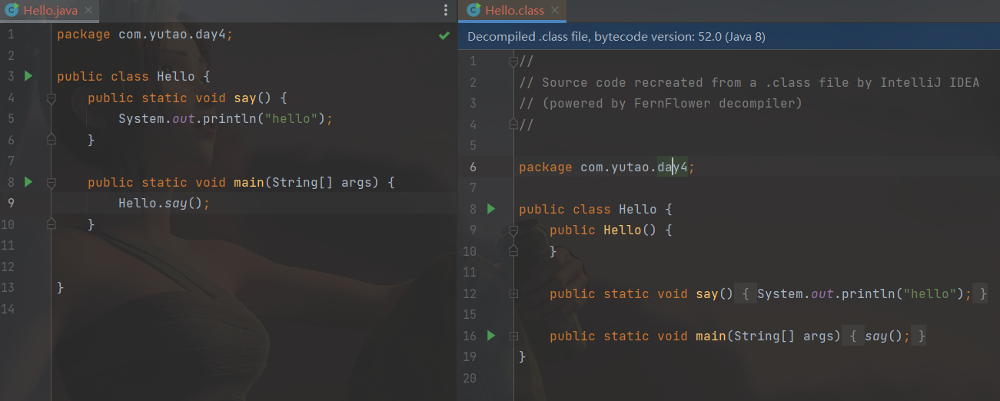
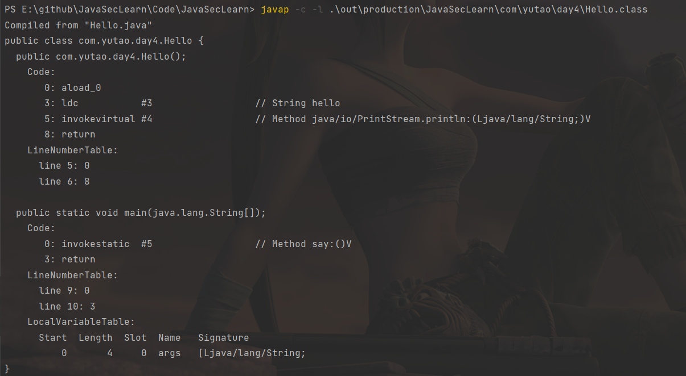
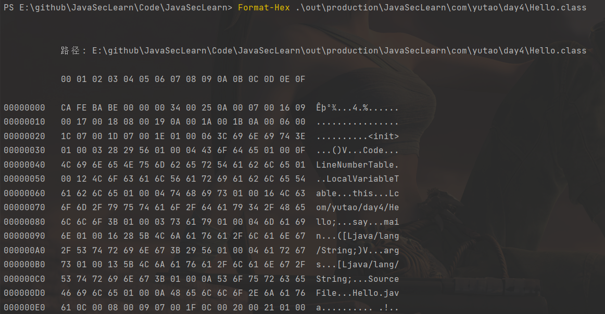
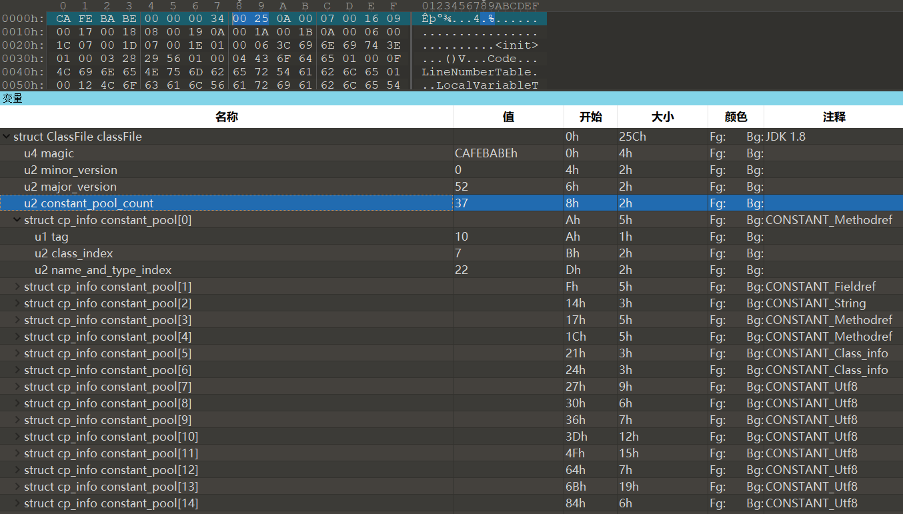
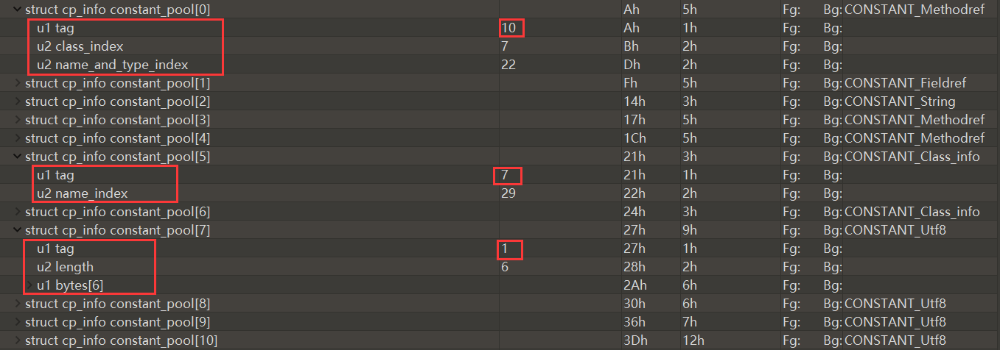
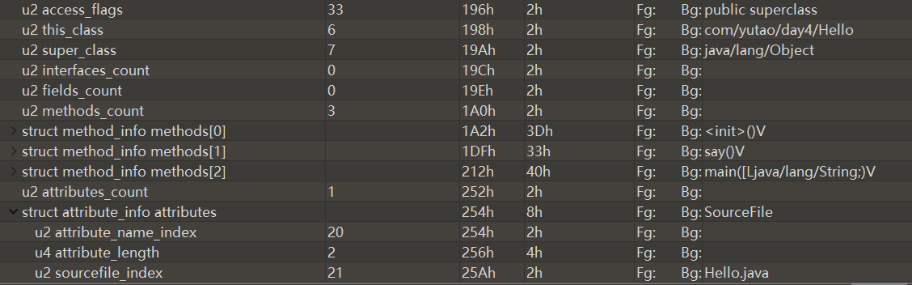

[toc]

# java字节码

java文件经过编译后会生成class文件，跟pe、png等种种文件一样，class文件也有其自己的文件格式。

java编译解析流程：

`源码.java-->(编译)-->源码.class)(java字节码)-->(编译/解析)-->机器码`



javap命令查看class文件结构和类方法字节码：



# class文件格式

>   https://docs.oracle.com/javase/specs/jvms/se15/html/jvms-4.html

class文件结构：(u1,u2,u4分别表示1/2/4字节的无符号数。可以使用java.io.DataInputStream读取：readUnsignedByte,readUnsignedShort,readInt.)

```c
ClassFile {
    u4 magic;
    u2 minor_version;
    u2 major_version;
    u2 constant_pool_count;
    cp_info constant_pool[constant_pool_count-1];
    u2 access_flags;
    u2 this_class;
    u2 super_class;
    u2 interfaces_count;
    u2 interfaces[interfaces_count];
    u2 fields_count;
    field_info fields[fields_count];
    u2 methods_count;
    method_info methods[methods_count];
    u2 attributes_count;
    attribute_info attributes[attributes_count];
}
```




`CA FE BA BE`：magic

`00 00 00 34`：版本号



## Magic

不解释，但凡见过PE或者jpg，png的都懂


## Version


| JDK版本 | **十进制** | **十六进制** | 发布时间 |
| ------- | ---------- | ------------ | -------- |
| JDK1.1  | 45         | 2D           | 1996-05  |
| JDK1.2  | 46         | 2E           | 1998-12  |
| JDK1.3  | 47         | 2F           | 2000-05  |
| JDK1.4  | 48         | 30           | 2002-02  |
| JDK1.5  | 49         | 31           | 2004-09  |
| JDK1.6  | 50         | 32           | 2006-12  |
| JDK1.7  | 51         | 33           | 2011-07  |
| JDK1.8  | 52         | 34           | 2014-03  |
| Java9   | 53         | 35           | 2017-09  |
| Java10  | 54         | 36           | 2018-03  |
| Java11  | 55         | 37           | 2018-09  |
| Java12  | 56         | 38           | 2019-03  |
| Java13  | 57         | 39           | 2019-09  |
| Java14  | 58         | 3A           | 2020-03  |
| Java15  | 59         | 3B           | 2020-09  |

## constant_pool_count

表示的是常量池中的数量，`constant_pool_count`的值等于常量池中的数量加1，需要特别注意的是`long`和`double`类型的常量池对象占用两个常量位。

如上的是`0x0025 == 37`

## constant_pool

`cp_info constant_pool[constant_pool_count-1];`，表结构；cp_info表示常量池对象。

cp_info结构：

```c
cp_info {
   u1 tag;//常量池中的存储类型
   u1 info[];
}
```

| **常量池类型**              | Tag  | 章节    |
| --------------------------- | ---- | ------- |
| CONSTANT_Utf8               | 1    | §4.4.7  |
| CONSTANT_Integer            | 3    | §4.4.4  |
| CONSTANT_Float              | 4    | §4.4.4  |
| CONSTANT_Long               | 5    | §4.4.5  |
| CONSTANT_Double             | 6    | §4.4.5  |
| CONSTANT_Class              | 7    | §4.4.1  |
| CONSTANT_String             | 8    | §4.4.3  |
| CONSTANT_Fieldref           | 9    | §4.4.2  |
| CONSTANT_Methodref          | 10   | §4.4.2  |
| CONSTANT_InterfaceMethodref | 11   | §4.4.2  |
| CONSTANT_NameAndType        | 12   | §4.4.6  |
| CONSTANT_MethodHandle       | 15   | §4.4.8  |
| CONSTANT_MethodType         | 16   | §4.4.9  |
| CONSTANT_Dynamic            | 17   | §4.4.10 |
| CONSTANT_InvokeDynamic      | 18   | §4.4.10 |
| CONSTANT_Module             | 19   | §4.4.11 |
| CONSTANT_Package            | 20   | §4.4.12 |

每一个tag都有不同的结构，见：https://docs.oracle.com/javase/specs/jvms/se15/html/jvms-4.html#jvms-4.4：



## access_flags

访问标志，表示某个类或者接口的访问权限和属性。

| 标志名         | 十六进制值 | 描述                                                   |
| -------------- | ---------- | ------------------------------------------------------ |
| ACC_PUBLIC     | 0x0001     | 声明为public                                           |
| ACC_FINAL      | 0x0010     | 声明为final                                            |
| ACC_SUPER      | 0x0020     | 废弃/仅JDK1.0.2前使用                                  |
| ACC_INTERFACE  | 0x0200     | 声明为接口                                             |
| ACC_ABSTRACT   | 0x0400     | 声明为abstract                                         |
| ACC_SYNTHETIC  | 0x1000     | 声明为synthetic，表示该class文件并非由Java源代码所生成 |
| ACC_ANNOTATION | 0x2000     | 标识注解类型                                           |
| ACC_ENUM       | 0x4000     | 标识枚举类型                                           |

接下来的几个：



## this_class

当前类名称，表示的是当前class文件的类名所在常量池中的索引位置。

## super_class

当前类的父类名称。表示的是当前class文件的父类类名所在常量池中的索引位置。`java/lang/Object`类的`super_class`的为0，其他任何类的`super_class`都必须是一个常量池中存在的索引位置。

## interfaces_count

当前类 继承或者实现的接口数。

## interfaces[interfaces_count]

接口数组

## fields_count

当前类成员变量数

## fields[fields_count]

`field_info fields[fields_count];`，成员变量数组，

`field_info`结构：

```java
field_info {
    u2             access_flags;//表示的是成员变量的修饰符；
    u2             name_index;//成员变量的名称；
    u2             descriptor_index;//成员变量的描述符；
    u2             attributes_count;//成员变量的属性数量；
    attribute_info attributes[attributes_count];//成员变量的属性信息；
}
```

都可查到。

## methods_count

当前类的成员方法个数

##  methods[]

成员方法数组

`method_info`结构(跟上面的差不多)：

```java
method_info {
   u2 access_flags;
   u2 name_index;
   u2 descriptor_index;
   u2 attributes_count;
   attribute_info attributes[attributes_count];
}
```

## attributes_count

当前class文件属性表的成员个数

## attributes[attributes_count]

表示的是当前class文件的所有属性。

结构：

```java
attribute_info {
   u2 attribute_name_index;
   u4 attribute_length;
   u1 info[attribute_length];
}
```

## class文件解析

用于解析的testclass文件：

```java
package com.yutao.day4;

import java.io.Serializable;

public class TestHelloClass implements Serializable {

    private static final long serialVersionUID = -7366591802115333975L;

    private long id = 1l;

    private String username;

    private String password;

    public String hello(String content) {
        String str = "Hello:";
        return str + content;
    }

    public static void main(String[] args) {
        TestHelloClass test = new TestHelloClass();
        String str = test.hello("Hello World~");

        System.out.println(str);
    }

    public long getId() {
        return id;
    }

    public void setId(long id) {
        this.id = id;
    }

    public String getUsername() {
        return username;
    }

    public void setUsername(String username) {
        this.username = username;
    }

    public String getPassword() {
        return password;
    }

    public void setPassword(String password) {
        this.password = password;
    }

    @Override
    public String toString() {
        return "TestHelloWorld{" +
                "id=" + id +
                ", username='" + username + '\'' +
                ", password='" + password + '\'' +
                '}';
    }
}
```


```sh
PS E:\github\JavaSecLearn\Code\JavaSecLearn> javap -v  .\out\production\JavaSecLearn\com\yutao\day4\TestHelloClass.class
Classfile /E:/github/JavaSecLearn/Code/JavaSecLearn/out/production/JavaSecLearn/com/yutao/day4/TestHelloClass.class
  Last modified 2022年4月24日; size 1923 bytes
  MD5 checksum 0e493daa1b7a7eb298e4fb1fd448b2b6
  Compiled from "TestHelloClass.java"
public class com.yutao.day4.TestHelloClass implements java.io.Serializable
  minor version: 0
  major version: 52
  flags: (0x0021) ACC_PUBLIC, ACC_SUPER
  this_class: #8                          // com/yutao/day4/TestHelloClass
  super_class: #21                        // java/lang/Object
  interfaces: 1, fields: 4, methods: 10, attributes: 1
Constant pool:
   #1 = Methodref          #21.#61        // java/lang/Object."<init>":()V
   #2 = Fieldref           #8.#62         // com/yutao/day4/TestHelloClass.id:J
   #3 = String             #63            // Hello:
   #4 = Class              #64            // java/lang/StringBuilder
   #5 = Methodref          #4.#61         // java/lang/StringBuilder."<init>":()V
   #6 = Methodref          #4.#65         // java/lang/StringBuilder.append:(Ljava/lang/String;)Ljava/lang/StringBuilder;
   #7 = Methodref          #4.#66         // java/lang/StringBuilder.toString:()Ljava/lang/String;
   #8 = Class              #67            // com/yutao/day4/TestHelloClass
   #9 = Methodref          #8.#61         // com/yutao/day4/TestHelloClass."<init>":()V
  #10 = String             #68            // Hello World~
  #11 = Methodref          #8.#69         // com/yutao/day4/TestHelloClass.hello:(Ljava/lang/String;)Ljava/lang/String;
  #12 = Fieldref           #70.#71        // java/lang/System.out:Ljava/io/PrintStream;
  #13 = Methodref          #72.#73        // java/io/PrintStream.println:(Ljava/lang/String;)V
  #14 = Fieldref           #8.#74         // com/yutao/day4/TestHelloClass.username:Ljava/lang/String;
  #15 = Fieldref           #8.#75         // com/yutao/day4/TestHelloClass.password:Ljava/lang/String;
  #16 = String             #76            // TestHelloWorld{id=
  #17 = Methodref          #4.#77         // java/lang/StringBuilder.append:(J)Ljava/lang/StringBuilder;
  #18 = String             #78            // , username=\'
  #19 = Methodref          #4.#79         // java/lang/StringBuilder.append:(C)Ljava/lang/StringBuilder;
  #20 = String             #80            // , password=\'
  #21 = Class              #81            // java/lang/Object
  #22 = Class              #82            // java/io/Serializable
  #23 = Utf8               serialVersionUID
  #24 = Utf8               J
  #25 = Utf8               ConstantValue
  #26 = Long               -7366591802115333975l
  #28 = Utf8               id
  #29 = Utf8               username
  #30 = Utf8               Ljava/lang/String;
  #31 = Utf8               password
  #32 = Utf8               <init>
  #33 = Utf8               ()V
  #34 = Utf8               Code
  #35 = Utf8               LineNumberTable
  #36 = Utf8               LocalVariableTable
  #37 = Utf8               this
  #38 = Utf8               Lcom/yutao/day4/TestHelloClass;
  #39 = Utf8               hello
  #40 = Utf8               (Ljava/lang/String;)Ljava/lang/String;
  #41 = Utf8               content
  #42 = Utf8               str
  #43 = Utf8               main
  #44 = Utf8               ([Ljava/lang/String;)V
  #45 = Utf8               args
  #46 = Utf8               [Ljava/lang/String;
  #47 = Utf8               test
  #48 = Utf8               getId
  #49 = Utf8               ()J
  #50 = Utf8               setId
  #51 = Utf8               (J)V
  #52 = Utf8               getUsername
  #53 = Utf8               ()Ljava/lang/String;
  #54 = Utf8               setUsername
  #55 = Utf8               (Ljava/lang/String;)V
  #56 = Utf8               getPassword
  #57 = Utf8               setPassword
  #58 = Utf8               toString
  #59 = Utf8               SourceFile
  #60 = Utf8               TestHelloClass.java
  #61 = NameAndType        #32:#33        // "<init>":()V
  #62 = NameAndType        #28:#24        // id:J
  #63 = Utf8               Hello:
  #64 = Utf8               java/lang/StringBuilder
  #65 = NameAndType        #83:#84        // append:(Ljava/lang/String;)Ljava/lang/StringBuilder;
  #66 = NameAndType        #58:#53        // toString:()Ljava/lang/String;
  #67 = Utf8               com/yutao/day4/TestHelloClass
  #68 = Utf8               Hello World~
  #69 = NameAndType        #39:#40        // hello:(Ljava/lang/String;)Ljava/lang/String;
  #70 = Class              #85            // java/lang/System
  #71 = NameAndType        #86:#87        // out:Ljava/io/PrintStream;
  #72 = Class              #88            // java/io/PrintStream
  #73 = NameAndType        #89:#55        // println:(Ljava/lang/String;)V
  #74 = NameAndType        #29:#30        // username:Ljava/lang/String;
  #75 = NameAndType        #31:#30        // password:Ljava/lang/String;
  #76 = Utf8               TestHelloWorld{id=
  #77 = NameAndType        #83:#90        // append:(J)Ljava/lang/StringBuilder;
  #78 = Utf8               , username=\'
  #79 = NameAndType        #83:#91        // append:(C)Ljava/lang/StringBuilder;
  #80 = Utf8               , password=\'
  #81 = Utf8               java/lang/Object
  #82 = Utf8               java/io/Serializable
  #83 = Utf8               append
  #84 = Utf8               (Ljava/lang/String;)Ljava/lang/StringBuilder;
  #85 = Utf8               java/lang/System
  #86 = Utf8               out
  #87 = Utf8               Ljava/io/PrintStream;
  #88 = Utf8               java/io/PrintStream
  #89 = Utf8               println
  #90 = Utf8               (J)Ljava/lang/StringBuilder;
  #91 = Utf8               (C)Ljava/lang/StringBuilder;
{
  public com.yutao.day4.TestHelloClass();
        descriptor: ()V
    flags: (0x0001) ACC_PUBLIC
    Code:
      stack=3, locals=1, args_size=1
         0: aload_0
         1: invokespecial #1                  // Method java/lang/Object."<init>":()V
         4: aload_0
         5: lconst_1
         6: putfield      #2                  // Field id:J
         9: return
      LineNumberTable:
        line 5: 0
        line 9: 4
      LocalVariableTable:
        Start  Length  Slot  Name   Signature
            0      10     0  this   Lcom/yutao/day4/TestHelloClass;

  public java.lang.String hello(java.lang.String);
    descriptor: (Ljava/lang/String;)Ljava/lang/String;
    flags: (0x0001) ACC_PUBLIC
    Code:
      stack=2, locals=3, args_size=2
         0: ldc           #3                  // String Hello:
         2: astore_2
         3: new           #4                  // class java/lang/StringBuilder
         6: dup
         7: invokespecial #5                  // Method java/lang/StringBuilder."<init>":()V
        10: aload_2
        11: invokevirtual #6                  // Method java/lang/StringBuilder.append:(Ljava/lang/String;)Ljava/lang/StringBuilder;
        14: aload_1
        15: invokevirtual #6                  // Method java/lang/StringBuilder.append:(Ljava/lang/String;)Ljava/lang/StringBuilder;
        18: invokevirtual #7                  // Method java/lang/StringBuilder.toString:()Ljava/lang/String;
        21: areturn
      LineNumberTable:
        line 16: 0
        line 17: 3
      LocalVariableTable:
        Start  Length  Slot  Name   Signature
            0      22     0  this   Lcom/yutao/day4/TestHelloClass;
            0      22     1 content   Ljava/lang/String;
            3      19     2   str   Ljava/lang/String;

  public static void main(java.lang.String[]);
    descriptor: ([Ljava/lang/String;)V
    flags: (0x0009) ACC_PUBLIC, ACC_STATIC
    Code:
      stack=2, locals=3, args_size=1
         0: new           #8                  // class com/yutao/day4/TestHelloClass
         3: dup
         4: invokespecial #9                  // Method "<init>":()V
         7: astore_1
         8: aload_1
         9: ldc           #10                 // String Hello World~
        11: invokevirtual #11                 // Method hello:(Ljava/lang/String;)Ljava/lang/String;
        14: astore_2
        15: getstatic     #12                 // Field java/lang/System.out:Ljava/io/PrintStream;
        18: aload_2
        19: invokevirtual #13                 // Method java/io/PrintStream.println:(Ljava/lang/String;)V
        22: return
      LineNumberTable:
        line 21: 0
        line 22: 8
        line 24: 15
        line 25: 22
      LocalVariableTable:
        Start  Length  Slot  Name   Signature
            0      23     0  args   [Ljava/lang/String;
            8      15     1  test   Lcom/yutao/day4/TestHelloClass;
           15       8     2   str   Ljava/lang/String;

  public long getId();
    descriptor: ()J
    flags: (0x0001) ACC_PUBLIC
    Code:
      stack=2, locals=1, args_size=1
         0: aload_0
         1: getfield      #2                  // Field id:J
         4: lreturn
      LineNumberTable:
        line 28: 0
      LocalVariableTable:
        Start  Length  Slot  Name   Signature
            0       5     0  this   Lcom/yutao/day4/TestHelloClass;

  public void setId(long);
    descriptor: (J)V
    flags: (0x0001) ACC_PUBLIC
    Code:
      stack=3, locals=3, args_size=2
         0: aload_0
         1: lload_1
         2: putfield      #2                  // Field id:J
         5: return
      LineNumberTable:
        line 32: 0
        line 33: 5
      LocalVariableTable:
        Start  Length  Slot  Name   Signature
            0       6     0  this   Lcom/yutao/day4/TestHelloClass;
            0       6     1    id   J

  public java.lang.String getUsername();
    descriptor: ()Ljava/lang/String;
    flags: (0x0001) ACC_PUBLIC
    Code:
      stack=1, locals=1, args_size=1
         0: aload_0
         1: getfield      #14                 // Field username:Ljava/lang/String;
         4: areturn
      LineNumberTable:
        line 36: 0
      LocalVariableTable:
        Start  Length  Slot  Name   Signature
            0       5     0  this   Lcom/yutao/day4/TestHelloClass;

  public void setUsername(java.lang.String);
    descriptor: (Ljava/lang/String;)V
    flags: (0x0001) ACC_PUBLIC
    Code:
      stack=2, locals=2, args_size=2
         0: aload_0
         1: aload_1
         2: putfield      #14                 // Field username:Ljava/lang/String;
         5: return
      LineNumberTable:
        line 40: 0
        line 41: 5
      LocalVariableTable:
        Start  Length  Slot  Name   Signature
            0       6     0  this   Lcom/yutao/day4/TestHelloClass;
            0       6     1 username   Ljava/lang/String;

  public java.lang.String getPassword();
    descriptor: ()Ljava/lang/String;
    flags: (0x0001) ACC_PUBLIC
    Code:
      stack=1, locals=1, args_size=1
         0: aload_0
         1: getfield      #15                 // Field password:Ljava/lang/String;
         4: areturn
      LineNumberTable:
        line 44: 0
      LocalVariableTable:
        Start  Length  Slot  Name   Signature
            0       5     0  this   Lcom/yutao/day4/TestHelloClass;

  public void setPassword(java.lang.String);
    descriptor: (Ljava/lang/String;)V
    flags: (0x0001) ACC_PUBLIC
    Code:
      stack=2, locals=2, args_size=2
         0: aload_0
         1: aload_1
         2: putfield      #15                 // Field password:Ljava/lang/String;
         5: return
      LineNumberTable:
        line 48: 0
        line 49: 5
      LocalVariableTable:
        Start  Length  Slot  Name   Signature
            0       6     0  this   Lcom/yutao/day4/TestHelloClass;
            0       6     1 password   Ljava/lang/String;

  public java.lang.String toString();
    descriptor: ()Ljava/lang/String;
    flags: (0x0001) ACC_PUBLIC
    Code:
      stack=3, locals=1, args_size=1
         0: new           #4                  // class java/lang/StringBuilder
         3: dup
         4: invokespecial #5                  // Method java/lang/StringBuilder."<init>":()V
         7: ldc           #16                 // String TestHelloWorld{id=
         9: invokevirtual #6                  // Method java/lang/StringBuilder.append:(Ljava/lang/String;)Ljava/lang/StringBuilder;
        12: aload_0
        13: getfield      #2                  // Field id:J
        16: invokevirtual #17                 // Method java/lang/StringBuilder.append:(J)Ljava/lang/StringBuilder;
        19: ldc           #18                 // String , username=\'
        21: invokevirtual #6                  // Method java/lang/StringBuilder.append:(Ljava/lang/String;)Ljava/lang/StringBuilder;
        24: aload_0
        25: getfield      #14                 // Field username:Ljava/lang/String;
        28: invokevirtual #6                  // Method java/lang/StringBuilder.append:(Ljava/lang/String;)Ljava/lang/StringBuilder;
        31: bipush        39
        33: invokevirtual #19                 // Method java/lang/StringBuilder.append:(C)Ljava/lang/StringBuilder;
        36: ldc           #20                 // String , password=\'
        38: invokevirtual #6                  // Method java/lang/StringBuilder.append:(Ljava/lang/String;)Ljava/lang/StringBuilder;
        41: aload_0
        42: getfield      #15                 // Field password:Ljava/lang/String;
        45: invokevirtual #6                  // Method java/lang/StringBuilder.append:(Ljava/lang/String;)Ljava/lang/StringBuilder;
        48: bipush        39
        50: invokevirtual #19                 // Method java/lang/StringBuilder.append:(C)Ljava/lang/StringBuilder;
        53: bipush        125
        55: invokevirtual #19                 // Method java/lang/StringBuilder.append:(C)Ljava/lang/StringBuilder;
        58: invokevirtual #7                  // Method java/lang/StringBuilder.toString:()Ljava/lang/String;
        61: areturn
      LineNumberTable:
        line 53: 0
      LocalVariableTable:
        Start  Length  Slot  Name   Signature
            0      62     0  this   Lcom/yutao/day4/TestHelloClass;
}
SourceFile: "TestHelloClass.java"

```


# 虚拟机指令集

使用上面的hello方法：

```java
public String hello(String content) {
	String str = "Hello:";
	return str + content;
}
```


```java
public java.lang.String hello(java.lang.String);
    descriptor: (Ljava/lang/String;)Ljava/lang/String;
    flags: (0x0001) ACC_PUBLIC
    Code:
      stack=2, locals=3, args_size=2
         0: ldc           #3                  // String Hello:
         2: astore_2
         3: new           #4                  // class java/lang/StringBuilder
         6: dup
         7: invokespecial #5                  // Method java/lang/StringBuilder."<init>":()V
        10: aload_2
        11: invokevirtual #6                  // Method java/lang/StringBuilder.append:(Ljava/lang/String;)Ljava/lang/StringBuilder;
        14: aload_1
        15: invokevirtual #6                  // Method java/lang/StringBuilder.append:(Ljava/lang/String;)Ljava/lang/StringBuilder;
        18: invokevirtual #7                  // Method java/lang/StringBuilder.toString:()Ljava/lang/String;
        21: areturn
      LineNumberTable:
        line 16: 0
        line 17: 3
      LocalVariableTable:
        Start  Length  Slot  Name   Signature
            0      22     0  this   Lcom/yutao/day4/TestHelloClass;
            0      22     1 content   Ljava/lang/String;
            3      19     2   str   Ljava/lang/String;
```

>   **hello方法字节码解析：**
>
>   1.  `ldc`表示的是将int, float或String型常量值从常量池中推送至栈顶，而`ldc #3`表示的是将常量池中的第三个索引位置压入栈顶，也就是`Hello:`；
>   2.  `astore_2`表示的是将栈顶的值存入到`局部变量表`的第二个位置，`局部变量表`的索引位置是从0开始的，因为`hello`方法是一个非静态方法，所以索引0表示的是`this`对象（如果是`static`方法那么就意味着没有`this`对象，索引0就应该表示第一个参数）。索引1表示的是`hello`方法的第一个参数，也就是`String content`。如果在方法体中想创建一个新的对象，那么就必须计算这个变量在局部变量表中的索引位置，否则无法存储对象。还有一个需要特别注意的点是`long`和`double`是宽类型(`wide type`)需要占用两个索引位置。`astore_2`实际上表达的是将栈顶的对象压入到局部变量表中，等价于`String arg2 = new String("Hello:")`；
>   3.  `new #4`表示的是创建`java/lang/StringBuilder`类实例；
>   4.  `dup`表示复制栈顶数值并将复制值压入栈顶，即`StringBuilder`对象；
>   5.  `invokespecial #5`，`invokespecial`表示的是调用超类构造方法，实例初始化方法，私有方法，即调用`StringBuilder`类的构造方法(`<init>`)，`#5`在常量池中是一个`CONSTANT_METHOD_REF`类型的对象，用于表示一个类方法引用，`invokespecial #5`实际上是在调用的`StringBuilder`的构造方法，等价于：`new StringBuilder()`；
>   6.  `aload_2`表示的是加载局部变量表中的第二个变量，也就是读取`astore_2`存入的值，即`Hello:`。
>   7.  `invokevirtual #6`表示的是调用`StringBuilder`类的`append`方法，等价于：`sb.append("Hello:")`；
>   8.  `aload_1`表示的是将局部变量表中的第一个变量压入栈顶，也就是将`hello`方法的第一个参数`content`的值压入栈顶；
>   9.  `invokevirtual #6`，再次调用`StringBuilder`类的`append`方法，等价于：`sb.append(content)`；
>   10.  `invokevirtual #7`，调用`StringBuilder`类的`toString`方法，等价于：`sb.toString()`；
>   11.  `areturn`表示的是返回一个引用类型对象，需要注意的是如果不同的数据类型需要使用正确的return指令；


# RMI

