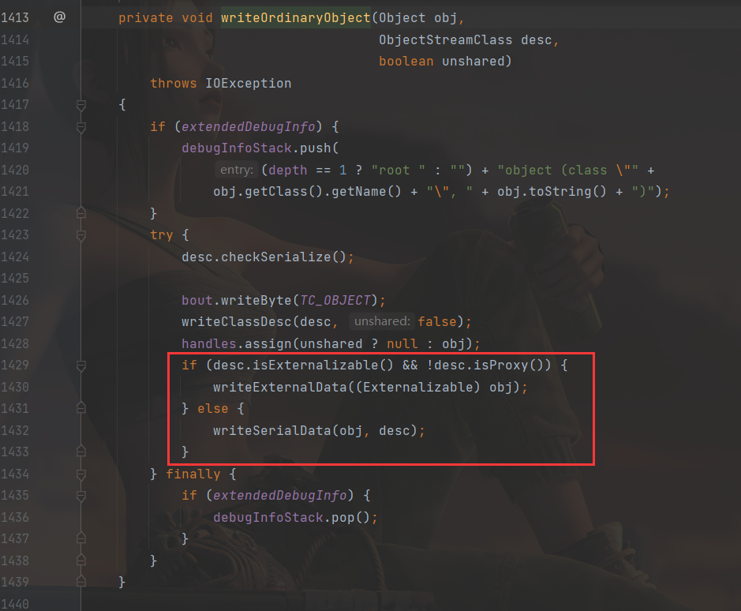

[toc]

Unsafe

>   https://www.cnblogs.com/nice0e3/p/14102892.html


序列化与反序列化：

>   https://paper.seebug.org/312/
>
>   https://laotun.top/2021/12/24/java%e5%ba%8f%e5%88%97%e5%8c%96%e4%b8%8e%e5%8f%8d%e5%ba%8f%e5%88%97%e5%ad%a6%e4%b9%a0%e4%b8%80/
>
>   https://cryin.github.io/blog/secure-development-java-deserialization-vulnerability/
>
>   https://www.anquanke.com/post/id/169563


#  sun.misc.Unsafe

` sun.misc.Unsafe`是java底层的一个api，仅限java内部使用。

提供了一些非常底层的api，和名字一样，都是不安全的。

该类默认为`BootstrapClassLoader`引导类加载器加载。

该类提供的一些API：


## 获取unsafe对象

unsafe是java内部的api，外部禁止调用：

unsafe中：

```java
package sun.misc;
import xxxxxxx;
public final class Unsafe {
    private static final Unsafe theUnsafe;
    .......................;
    private static native void registerNatives();

    private Unsafe() {
    }

    @CallerSensitive
    public static Unsafe getUnsafe() {
        Class var0 = Reflection.getCallerClass();
        if (!VM.isSystemDomainLoader(var0.getClassLoader())) {
            throw new SecurityException("Unsafe");
        } else {
            return theUnsafe;
        }
    }
    ........................;
    
}
```


如上，Unsafe类不能被继承，也不能被new。提供了`getUnsafe`方法，只有当调用`getUnsafe`方法的类为引导类加载器加载时才合法（`isSystemDomainLoader()`）。否则抛出异常。

`isSystemDomainLoader`：

即当结果为true是，var0才是引导类加载器加载，否则是其他类加载器。


下面介绍获取unsafe类的方法，有两种：

### 反射获取成员变量

前文中unsafe类中的theunsafe为该类的实例化，可以直接反射获取：


示例：

```java
        Class<?> cls = Class.forName("sun.misc.Unsafe");
//        所有成员变量，public,private...
        Field theUnsafe = cls.getDeclaredField("theUnsafe");
//        theUnsafe为私有必须有setAccessible，修改访问权限
        theUnsafe.setAccessible(true);
//		反射获取theUnsafe成员变量值
        Unsafe uf = (Unsafe) theUnsafe.get(null);
//        返回系统指针的大小。返回值为4（32位系统）或 8（64位系统）。
        System.out.println(uf.addressSize());
```


### 反射调用getUnsafe()

```java
Class<?> cls = Class.forName("sun.misc.Unsafe");
Constructor<?> constructor = cls.getDeclaredConstructor();
constructor.setAccessible(true);
Unsafe sf = (Unsafe) constructor.newInstance();
System.out.println(sf.addressSize());
```


### allocateInstance无视构造方法创建类实例

假若有个unsafetest类，因为某些原因无法反射构造类实例，可以使用Unsafe的`allocateInstance`来绕过

```java
package com.yutao.day5;

import sun.misc.Unsafe;

import java.lang.reflect.Constructor;
import java.lang.reflect.Field;

class unsafetest {
    private unsafetest() {
        System.out.println("success");
    }
}

public class unsafe {
    public static void main(String[] args) throws Exception {
        Class<?> cls = Class.forName("sun.misc.Unsafe");
        Field theUnsafe = cls.getDeclaredField("theUnsafe");
        theUnsafe.setAccessible(true);
        Unsafe uf = (Unsafe) theUnsafe.get(null);
        unsafetest ust = (unsafetest) uf.allocateInstance(unsafetest.class);
        System.out.println(ust);

    }
}

```

## Unsafe相关API

### 内存相关

```java
public native long allocateMemory(long bytes);//分配内存, 相当于C++的malloc函数

public native long reallocateMemory(long address, long bytes);//扩充内存
public native void freeMemory(long address);//释放内存
public native void setMemory(Object o, long offset, long bytes, byte value);//在给定的内存块中设置值
public native void copyMemory(Object srcBase, long srcOffset, Object destBase, long destOffset, long bytes);//内存拷贝
public native Object getObject(Object o, long offset);//获取给定地址值，忽略修饰限定符的访问限制。与此类似操作还有: getInt，getDouble，getLong，getChar等
public native void putObject(Object o, long offset, Object x);//为给定地址设置值，忽略修饰限定符的访问限制，与此类似操作还有: putInt,putDouble，putLong，putChar等
public native byte getByte(long address);//获取给定地址的byte类型的值（当且仅当该内存地址为allocateMemory分配时，此方法结果为确定的）
public native void putByte(long address, byte x);//为给定地址设置byte类型的值（当且仅当该内存地址为allocateMemory分配时，此方法结果才是确定的）
```

### 系统信息

```java
public native int addressSize();  
//返回系统指针的大小。返回值为4（32位系统）或 8（64位系统）。
public native int pageSize();
//内存页的大小，此值为2的幂次方。
```

### 线程调度

```java
public native void unpark(Object thread);
// 终止挂起的线程，恢复正常.java.util.concurrent包中挂起操作都是在LockSupport类实现的，其底层正是使用这两个方法

public native void park(boolean isAbsolute, long time);

// 线程调用该方法，线程将一直阻塞直到超时，或者是中断条件出现。

@Deprecated
public native void monitorEnter(Object o);
//获得对象锁（可重入锁）

@Deprecated
public native void monitorExit(Object o);
//释放对象锁

@Deprecated
public native boolean tryMonitorEnter(Object o);
//尝试获取对象锁

```

### 操作对象

```java
// 传入一个Class对象并创建该实例对象，但不会调用构造方法
public native Object allocateInstance(Class<?> cls) throws InstantiationException;

// 获取字段f在实例对象中的偏移量
public native long objectFieldOffset(Field f);

// 返回值就是f.getDeclaringClass()
public native Object staticFieldBase(Field f);
// 静态属性的偏移量，用于在对应的Class对象中读写静态属性
public native long staticFieldOffset(Field f);

// 获得给定对象偏移量上的int值，所谓的偏移量可以简单理解为指针指向该变量；的内存地址，
// 通过偏移量便可得到该对象的变量，进行各种操作
public native int getInt(Object o, long offset);
// 设置给定对象上偏移量的int值
public native void putInt(Object o, long offset, int x);

// 获得给定对象偏移量上的引用类型的值
public native Object getObject(Object o, long offset);
// 设置给定对象偏移量上的引用类型的值
public native void putObject(Object o, long offset, Object x););

// 设置给定对象的int值，使用volatile语义，即设置后立马更新到内存对其他线程可见
public native void putIntVolatile(Object o, long offset, int x);
// 获得给定对象的指定偏移量offset的int值，使用volatile语义，总能获取到最新的int值。
public native int getIntVolatile(Object o, long offset);

// 与putIntVolatile一样，但要求被操作字段必须有volatile修饰
public native void putOrderedInt(Object o, long offset, int x);
```

### class相关操作

```java
//静态属性的偏移量，用于在对应的Class对象中读写静态属性
public native long staticFieldOffset(Field f);
//获取一个静态字段的对象指针
public native Object staticFieldBase(Field f);
//判断是否需要初始化一个类，通常在获取一个类的静态属性的时候（因为一个类如果没初始化，它的静态属性也不会初始化）使用。 当且仅当ensureClassInitialized方法不生效时返回false
public native boolean shouldBeInitialized(Class<?> c);
//确保类被初始化
public native void ensureClassInitialized(Class<?> c);
//定义一个类，可用于动态创建类，此方法会跳过JVM的所有安全检查，默认情况下，ClassLoader（类加载器）和ProtectionDomain（保护域）实例来源于调用者
public native Class<?> defineClass(String name, byte[] b, int off, int len,
                                   ClassLoader loader,
                                   ProtectionDomain protectionDomain);

//定义一个匿名类，可用于动态创建类
public native Class<?> defineAnonymousClass(Class<?> hostClass, byte[] data, Object[] cpPatches);

```


# 序列化与反序列化

跟php一样，java也有序列化和反序列化。

序列化：类对象转化为字节流。

序列化实现数据的持久化存储；序列化实现远程通讯。

反序列化限制：

1.  反序列化的类必须存在
2.  `serialVersionUID`一致


哪些类可以被序列化：实现`java.io.Serializable`或者`java.io.Externalizable`接口，其中`java.io.Externalizable`只是实现了`java.io.Serializable`接口。`java.io.Serializable`接口为空接口。

`java.io.Serializable`接口：


## ObjectOutputStream、ObjectInputStream

`ObjectOutputStream`、`ObjectInputStream`这两个类用来序列化和反序列化，用到的方法：

-   readObject：反序列化
-   writeObject：序列化

enableOverride:判断是否有重写xxx方法

```java
/** if true, invoke writeObjectOverride() instead of writeObject() */
private final boolean enableOverride;

/** if true, invoke readObjectOverride() instead of readObject() */
private final boolean enableOverride;
```

`writeObject()`，首先判断了是否有重写该方法，重写了就调用，否则调用`writeObject0(obj,false)`


readObject()：同样的，先判断是否有重写readObject方法，重写就调用，否则调用`readObject0(false)`


## Demo

Person类，实现`Serializable`接口

```java
package com.yutao.day5;

import java.io.Serializable;

public class Person implements Serializable {
    private String name;
    private int age;

    public Person() {
    }

    public Person(String name, int age) {
        this.name = name;
        this.age = age;
    }

    @Override
    public String toString() {
        return "name:" + this.name + "\nage:" + this.age;
    }
}
```

TEST:

```java
package com.yutao.day5;

import java.io.*;


public class serial {
    public static void main(String[] args) throws Exception {
        Person person = new Person("qqq", 123);
        FileOutputStream fos = new FileOutputStream("1.txt");
        ObjectOutputStream oops = new ObjectOutputStream(fos);
        oops.writeObject(person);
        oops.close();
        fos.close();
        FileInputStream fis = new FileInputStream("1.txt");

        ObjectInputStream ois = new ObjectInputStream(fis);
        Person s = (Person) ois.readObject();
        System.out.println("done");
        ois.close();
        fis.close();

    }
}
```

序列化生成的文件：


`AC ED` ：magic

`00 05`：版本号，和class文件中的一样

`73`：对象类型标识

`72`：类描述符标识

`00 15 63 xx xx ...` ：类名字符串长度和值。

`07 64 BA BD CA 75 0E 91`：序列版本唯一标识（serialVersionUID）

`02`：对象的序列化属性标志位

`00 02`：类的字段个数

`49`，整数类型签名的第一个字节，同理，之后的`4C`为字符串类型签名的第一个字节 

`00 03`，字段名字符串长度和值

`78`：数据块结束标识

`70`：父类描述符标识


## Demo2

```java
package com.yutao.day5;

import java.io.*;

class RCE implements java.io.Serializable {
    public String cmd;

    private void readObject(java.io.ObjectInputStream in) throws IOException, ClassNotFoundException, IOException {
        in.defaultReadObject();
        Runtime.getRuntime().exec(cmd);
    }
}

public class ToRCE {
    public static void main(String[] args) throws IOException, ClassNotFoundException {
        RCE testClass = new RCE();
        testClass.cmd = "calc";

        FileOutputStream fileoutputstream = new FileOutputStream("RCE.ser");
        ObjectOutputStream outputstream = new ObjectOutputStream(fileoutputstream);
        outputstream.writeObject(testClass);
        outputstream.close();


        FileInputStream fileinputstream = new FileInputStream("RCE.ser");
        ObjectInputStream inputstream = new ObjectInputStream(fileinputstream);
        RCE obj = (RCE) inputstream.readObject();
        inputstream.close();
    }
}
```

会直接弹calc，当然开发不可能这么纯，，利用的话当然是要构造反序列化链的，这个后面再说

## 跟一下序列化流程


首先是`ObjectOutputStream`


之后在`writeStreamHeader`里面写入magic和版本号：


对应的宏：


接下来是调用`writeObject`写对象数据，因为没有重写，所以调用的是`writeObject0`，其中重要的部分：


可以看到，如果没有实现Serializable接口，会抛出`NotSerializableException`异常

下面是`writeOrdinaryObject()`：写入对象数据



方框的上面：`writeClassDesc(desc, false);`中的`writeNonProxyDesc()`写入类描述数据。

-   写入类描述符标识
-   写入类名
-   写入SUID *（当SUID为空时，会进行计算并赋值，细节见下面关于SerialVersionUID章节）*
-   计算并写入序列化属性标志位
-   写入字段信息数据
-   写入Block Data结束标识
-   写入父类描述数据


方框中，如果实现了`Externalizable`接口，那么执行`writeExternalData()`；如果实现了`Serializable`接口，执行`writeSerialData()`。

-   `writeSerialData()`：写入对象的序列化数据，若类自定义了`writeObject()`，则调用该方法写对象，否则调用`defaultWriteFields()`写入对象的字段数据 。


反序列化的流程和上面差不多。

## 关于SerialVersionUID(留个坑之后写)

`writeNonProxyDesc`中的`writeNonProxy`，会执行`getSerialVersionUID()`

