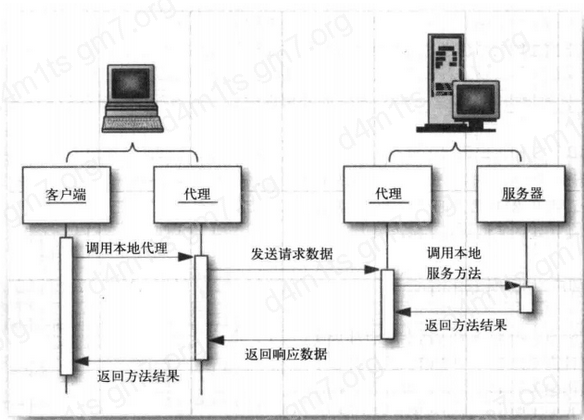
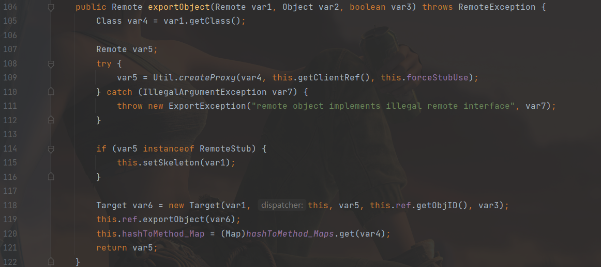

[toc]

rmi

>   https://paper.seebug.org/1091/
>
>   https://blog.gm7.org/%E4%B8%AA%E4%BA%BA%E7%9F%A5%E8%AF%86%E5%BA%93/02.%E4%BB%A3%E7%A0%81%E5%AE%A1%E8%AE%A1/01.Java%E5%AE%89%E5%85%A8/1.%E5%AE%A1%E8%AE%A1%E5%9F%BA%E7%A1%80/04.RMI%E5%9F%BA%E7%A1%80.html
>
>   https://javasec.org/javase/RMI/
>
>   https://ca01h.top/Java/javasec/2.Java%E5%AE%89%E5%85%A8%E5%AD%A6%E4%B9%A0%E4%B9%8BRMI/
>
>   https://www.freebuf.com/articles/web/252561.html

# RMI

## 概述

RMI(Rmote Method Invocation),即远程方法调用。

1.  RMI的传输是基于反序列化的。
2.  对于任何一个以对象为参数的RMI接口，你都可以发一个自己构建的对象，迫使服务器端将这个对象按任何一个存在于服务端classpath中的可序列化类来反序列化恢复对象。

`RMI`用于构建分布式应用程序，`RMI`实现了`Java`程序之间跨`JVM`的远程通信。

## RMI实现机制

首先来看两张图：

RMI交互流程：


RMI通信模式：




RMI模式中除了有Client与Server,还借助了一个Registry(注册中心)。

| Server                                                       | Registry                                                     | Client           |
| ------------------------------------------------------------ | ------------------------------------------------------------ | ---------------- |
| 提供具体的远程对象，本质就是一个map，相当于是字典一样，用于客户端查询要调用的方法的引用 | 一个注册表，存放着远程对象的位置（ip、端口、标识符），远程调用方法对象的提供者，也是代码真正执行的地方，执行结束会返回给客户端一个方法执行的结果 | 远程对象的使用者 |

其中Server与Registry可以在同一服务器上实现，也可以布置在不同服务器上，现在一个完整的RMI流程可以大概描述为：

1.  Registry先启动，并监听一个端口，一般为1099
2.  Server向Registry注册远程对象
3.  Client从Registry获得远程对象的代理（这个代理知道远程对象的在网络中的具体位置：ip、端口、标识符），然后Client通过这个代理调用远程方法，Server也是有一个代理的，Server端的代理会收到Client端的调用的方法、参数等，然后代理执行对应方法，并将结果通过网络返回给Client。

服务端在注册中心注册服务时，需要提供一个key以及一个value，这个value是一个远程对象，Registry会对这个远程对象进行封装，使其转为一个远程代理对象。当客户端想要调用远程对象的方法时，则需要先通过Registry获取到这个远程代理对象，使用远程代理对象与服务端开放的端口进行通信，从而取得调用方法的结果。


## 代码实现

-   创建一个远程接口，要继承`Remote`，并在定义时抛出`RemoteException`
-   实现上述接口类时，需要继承`UnicastRemoteObject`，以便序列化。
-   创建服务器实例，创建注册表，将需要踢狗给客户端的对象注册到注册表中
-   客户端调用远程对象代码

远程接口：

```java
package com.yutao.day6.rmi;

import java.rmi.Remote;
import java.rmi.RemoteException;

public interface rmtHello extends Remote {
    String hello() throws RemoteException;
}
```

接口类实现：

```java
package com.yutao.day6.rmi;

import java.rmi.RemoteException;
import java.rmi.server.UnicastRemoteObject;

public class rmtHelloImpl extends UnicastRemoteObject implements rmtHello {
    public rmtHelloImpl() throws RemoteException {
    }

    @Override
    public String hello() throws RemoteException {
        System.out.println("test success");
        return "im ok";
    }
}
```

服务端：

```java
package com.yutao.day6.rmi;

import java.rmi.RemoteException;
import java.rmi.registry.LocateRegistry;
import java.rmi.registry.Registry;

public class server {
    public static void main(String[] args) throws RemoteException {
        rmtHello rmthello = new rmtHelloImpl();
        Registry registry = LocateRegistry.createRegistry(1099);
        registry.rebind("hello", rmthello);
    }
}
```

客户端：

```java
package com.yutao.day6.rmi;

import java.rmi.NotBoundException;
import java.rmi.RemoteException;
import java.rmi.registry.LocateRegistry;
import java.rmi.registry.Registry;

public class client {
    public static void main(String[] args) throws RemoteException, NotBoundException {
        Registry reg = LocateRegistry.getRegistry("127.0.0.1", 1099);
        rmtHello rmthello1 = (rmtHello) reg.lookup("hello");
        //lookup作用就是获得某个远程对象
        System.out.println(rmthello1.hello());
    }
}
```

## RMI流程分析

RMI server，`LocateRegistry.createRegistry()`，返回`RegistryImpl(port)`


RMI Client ，使用`getRegistry`获取注册的对象，最终的调用为：

`public static Registry getRegistry(String host, int port,RMIClientSocketFactory csf)`，创建代理并返回：


`RMI Registry`，核心在：`RegistryImpl_Skel`，当客户端执行lookup或者服务端执行bind,rebind等时，均会执行：`sun.rmi.registry.RegistryImpl_Skel#dispatch`：


### bind

接口类继承了`UnicastRemoteObject`，实例化时会调用`exportObject`创建返回该服务的stub：




之后在通过bind向RMI Registry服务器申请注册绑定服务名

下面是`sun.rmi.registry.RegistryImpl_Stub#bind`：第三个参数对应operations里的操作。

之后的两个`writeObject()`，分别向var3写序列化后的服务名。


之后`RMI Registry`收到申请时，进入dispatch，opnum为0，两次读反序列化之后，bind写入键值，

### lookup

客户端向RMI Registry申请lookup查询的时候，opnum为2，并且反序列化了目标服务名：


# P牛的java安全漫谈-RMI篇

里面是这样的：

```java
server：
        rmtHello rmthello = new rmtHelloImpl();
        LocateRegistry.createRegistry(1099);
        Naming.bind("rmi://127.0.0.1/hello", rmthello);

Client：
    rmtHello rmthello = (rmtHello) Naming.lookup("rmi://127.0.0.1/hello");
```

对比下上面写的：

```java
Server:
        rmtHello rmthello = new rmtHelloImpl();
        Registry registry = LocateRegistry.createRegistry(1099);
        registry.rebind("hello", rmthello);
Client:
        Registry reg = LocateRegistry.getRegistry("127.0.0.1", 1099);
        rmtHello rmthello1 = (rmtHello) reg.lookup("hello");
```

>   RMI Registry就像⼀个⽹关，他⾃⼰是不会执⾏远程⽅法的，但RMI Server可以在上⾯注册⼀个Name 到对象的绑定关系；RMI Client通过Name向RMI Registry查询，得到这个绑定关系，然后再连接RMI Server；最后，远程⽅法实际上在RMI Server上调⽤。

上面自己写的那个Server端，使用的是rebind，这里要注意的是，只有本地的时候才可以rebind，如果是其他地址则会报错。

当目标服务器上有危险的方法，则可以使用功能RMI调用，但是，，，显然RMI的攻击不会这么无聊

## 利用codebase执行任意代码

很久以前，java可以在浏览器执行，就是`Applet`，使用时需要`codebase`属性：

```html
<applet>
    code="hello.class" codebase="Applets" width=xx height=ss
</applet>
```

除了applet，RMI也存在远程加载的场景，也会涉及到codebase。

codebase与CLASSPATH差不多，classpath找的是本地的路径 ，而codebase为远程URL地址。

当客户端发送数据到客户端进行反序列化之后，会先去CLASSPATH下找相应的类，如果没有找到，则会去codebase去找，比如`codebase="www.xx.com"`

假如要加载的类为xx.yy.z类，那么会找：`www.xx.com/xx.yy.x.class`，所以说，如果远程codebase被控制，就可以加载恶意类了。

条件：

1.  安装并配置SecurityManager

2.  版本低于7u21,6u54，或者设置属性：java.rmi.server.useCodebaseOnly=false

    ```java
    javac *.java
    java -Djava.rmi.server.hostname=192.168.135.142 -
    Djava.rmi.server.useCodebaseOnly=false -Djava.security.policy=client.policy
    RemoteRMIServer
    ```

    https://docs.oracle.com/javase/7/docs/technotes/guides/rmi/enhancements-7.html

SecurityManager：

加参数打开：`-Djava.security.manager`

policy为策略配置文件，指定哪些类有那些权限


# 最后

最后讲一个东西：`Annotationsclass`，后面序列化反序列化会用到

codebase传递是通过 `[Ljava.rmi.server.ObjID;` 的 `classAnnotations` 传递的，这里wireshark抓包使用`SerializationDumper`查看反序列化即可。

序列化反序列化的时候，会用到`objectOutputStream`，其内部有个方法：`annotateClass`，ObjectOutputStream 的子类有需要向序列化后的数据里放任何内容，都可以重写 这个方法，写入你自己想要写入的数据。然后反序列化时，就可以读取到这个信息并使用。


比如说：`MarshalOutputStream`类，该类继承了`ObjectOutputStream`，并实现了`annotateClass`方法：


